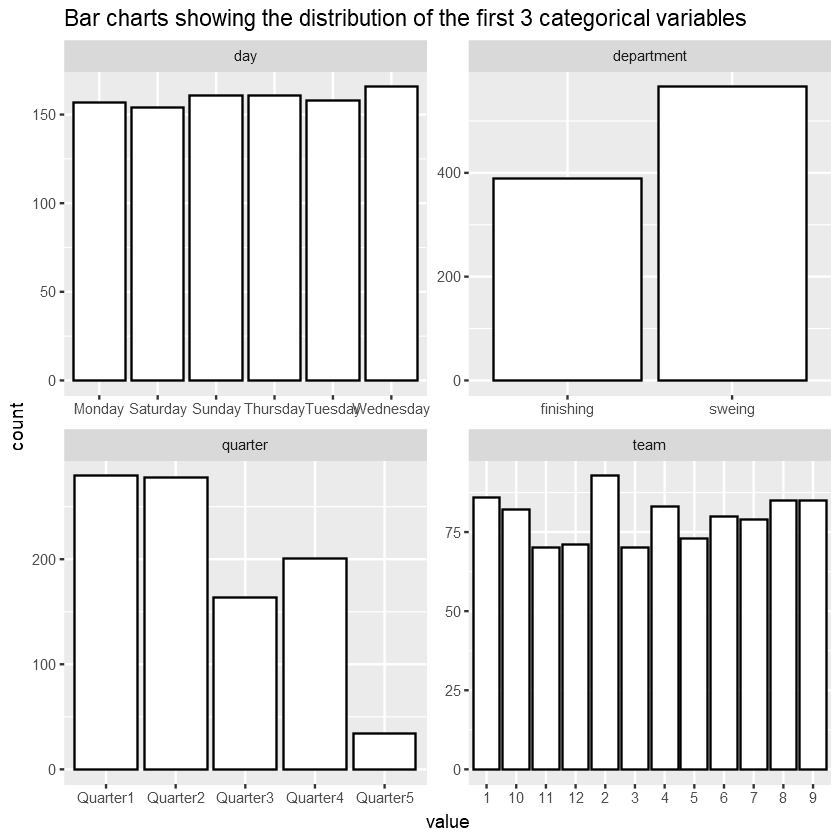
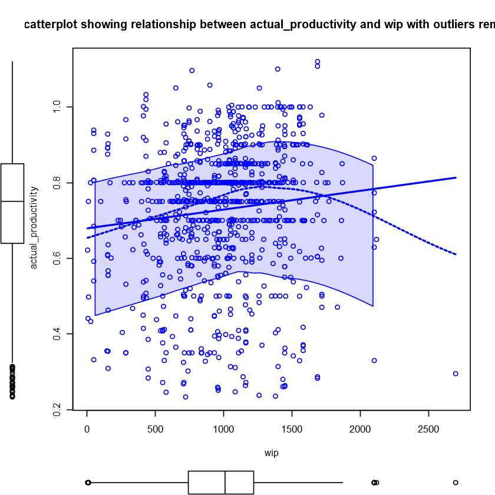
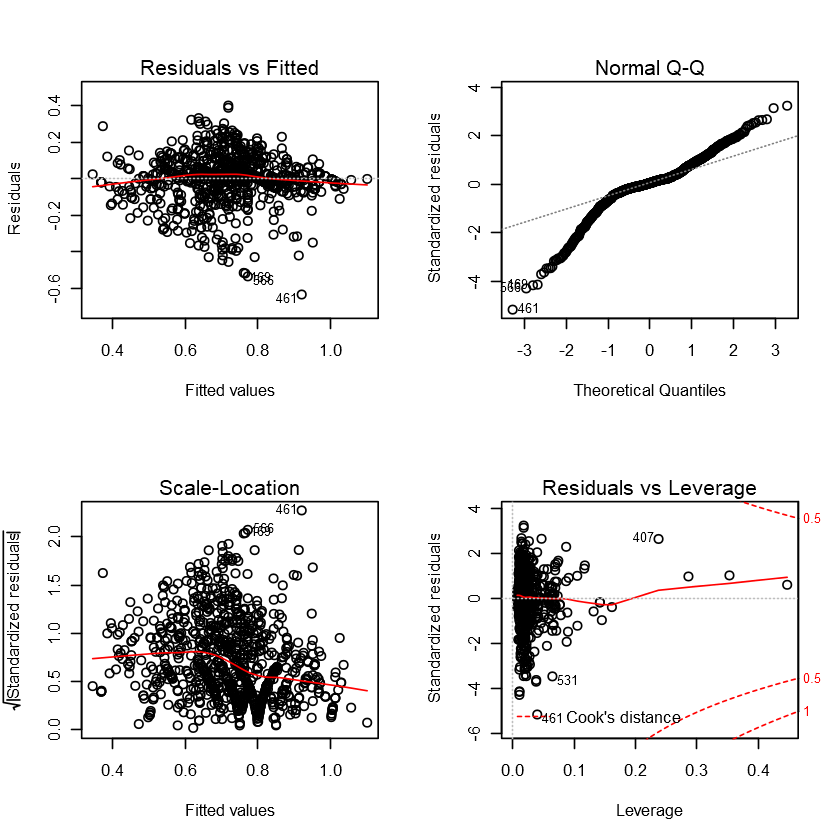

This is a rather long post because it is originally a Jupyter notebook file, and so I included all my thought process, as well as code, when doing Exploratory Data Analysis (EDA) and building simple prediction models.

With this post, I would like to showcase the typical routes I take when doing EDA, and building simple prediction models.

## Idea behind the project

I was browsing Kaggle and came across a competition to predict productivity level of garment industry employees. Given the labour intensive nature of the industry with many manual processes, I thought it would be interesting to give it a go.

The original dataset used can be found <a href="https://archive.ics.uci.edu/ml/datasets/Productivity+Prediction+of+Garment+Employees" title="UCI Dataset" target="_blank">here</a>.

## Housekeeping

Programming Language: R 3.8.11 in Jupyter Notebook

R Libraries used:
- ggplot2
- tidyverse
- reshape2
- glmnet
- caret
- car
- grid
- gridExtra
- corrplot

## 1. Introduction <a class="anchor" id="sec_1"></a>

This notebook contains the results of data analysis performed on a dataset containing important attributes of the garment manufacturing process and the productivity of the employees which had been collected manually and also been validated by the industry experts in Bangladesh. The aim of the data analysis is to build several models to predict employee productivity given some other factors in a factory. The models should be lightweight and lean, in order to maintain real-time capability, and satisfy the requirements of best-cost hardware of traction drives in an automative environment.

The first section of this notebook will be about the exploratory data analysis (EDA) performed to explore and understand the data, taking a look at each attribute (variable) in the data to understand the nature and distribution of the attribute values. It also examines the correlation between the variables through visualisations. A brief summary is provided at the end to highlight the key findings of the EDA. This includes: section 2 [Exploratory Data Analysis](#sec_3).

The second section shows the development of the linear regression models. It details the process used to build the models and shows the models at key points in the development process. Each model will be briefly analysed and its RMSE and summary statistics on the training set will be provided. This includes: section 3 [Methodology](#sec_4), and 4 [Model Development](#sec_5).
 
Then, in the final section, we will deploy all the models on the testing set and create a comparison table of RMSEs and R-Squared for both training and testing set to compare the performance of the models and pick the best one.

The final section provides the details of the model to ensure reproducibility. The final model is then presented along with an analysis and interpretation of its summary statistics. This includes: section 5: [Results and discussion](#sec_6).

Two datasets were provided for the assignment - train.csv and test.csv. The exploratory data analysis and the model building were done using the train.csv dataset; the test.csv dataset was used to test the generated models.

Let's now load the required libraries used in the notebook.

```R
library(ggplot2)
library(tidyverse)
library(reshape2)
library(glmnet)
library(caret)
library(car)
library(grid)
library(gridExtra)
library(corrplot)
```

## 2. Exploratory Data Analysis<a class="anchor" id="sec_3"></a>

### Splitting training and testing sets 


```R
# Load the dataset
garment_data <- read_csv("garments_employee_productivity.csv")

# Set random seed
set.seed(2)

# Create train and test sets, shuffling and spliting it 80:20
sample_size <- floor(0.8*nrow(garment_data))
train_index <- sample(seq_len(nrow(garment_data)),size = sample_size) #https://stackoverflow.com/questions/17200114/how-to-split-data-into-training-testing-sets-using-sample-function

train <- garment_data[train_index,]
test <- garment_data[-train_index,]

dim(train) # 957 records
dim(test) # 240 records
```


<ol class=list-inline>
	<li>957</li>
	<li>15</li>
</ol>


<ol class=list-inline>
	<li>240</li>
	<li>15</li>
</ol>


### Quick overview of the train dataset


```R
# Display the dimensions
cat("The garment productivity dataset has", dim(train)[1], "records, each with", dim(train)[2],
    "attributes. The structure is:\n\n")

# Display the structure
str(train)

cat("\nThe first few and last few records in the dataset are:")
# Inspect the first few records
head(train)
# And the last few
tail(train)

cat("\nBasic statistics for each attribute are:")
# Statistical summary 
summary(train)

cat("The numbers of unique values for each attribute are:")
apply(train, 2, function(x) length(unique(x)))
```

    The garment productivity dataset has 957 records, each with 15 attributes. The structure is:
    
    Classes 'tbl_df', 'tbl' and 'data.frame':	957 obs. of  15 variables:
     $ date                 : Date, format: "2015-02-28" "2015-02-10" ...
     $ quarter              : chr  "Quarter4" "Quarter2" "Quarter3" "Quarter4" ...
     $ department           : chr  "sweing" "sweing" "finishing" "finishing" ...
     $ day                  : chr  "Saturday" "Tuesday" "Sunday" "Saturday" ...
     $ team                 : num  10 7 11 9 8 3 7 1 4 4 ...
     $ targeted_productivity: num  0.7 0.5 0.6 0.6 0.8 0.5 0.35 0.8 0.8 0.8 ...
     $ smv                  : num  21.82 30.1 2.9 3.94 2.9 ...
     $ wip                  : num  1448 1025 1688 1448 970 ...
     $ over_time            : num  6120 6960 1200 1440 4800 ...
     $ incentive            : num  40 23 0 0 0 30 0 0 88 60 ...
     $ idle_time            : num  0 0 0 0 0 0 0 0 0 0 ...
     $ idle_men             : num  0 0 0 0 0 0 0 0 0 0 ...
     $ no_of_style_change   : num  1 1 0 0 0 0 1 0 0 0 ...
     $ no_of_workers        : num  51 58 10 8 8 56.5 58 10 57.5 56.5 ...
     $ actual_productivity  : num  0.7 0.501 0.715 0.261 0.398 ...
    
    The first few and last few records in the dataset are:


<table>
<thead><tr><th scope=col>date</th><th scope=col>quarter</th><th scope=col>department</th><th scope=col>day</th><th scope=col>team</th><th scope=col>targeted_productivity</th><th scope=col>smv</th><th scope=col>wip</th><th scope=col>over_time</th><th scope=col>incentive</th><th scope=col>idle_time</th><th scope=col>idle_men</th><th scope=col>no_of_style_change</th><th scope=col>no_of_workers</th><th scope=col>actual_productivity</th></tr></thead>
<tbody>
	<tr><td>2015-02-28</td><td>Quarter4  </td><td>sweing    </td><td>Saturday  </td><td>10        </td><td>0.7       </td><td>21.82     </td><td>1448      </td><td> 6120     </td><td>40        </td><td>0         </td><td>0         </td><td>1         </td><td>51.0      </td><td>0.7002366 </td></tr>
	<tr><td>2015-02-10</td><td>Quarter2  </td><td>sweing    </td><td>Tuesday   </td><td> 7        </td><td>0.5       </td><td>30.10     </td><td>1025      </td><td> 6960     </td><td>23        </td><td>0         </td><td>0         </td><td>1         </td><td>58.0      </td><td>0.5008017 </td></tr>
	<tr><td>2015-02-15</td><td>Quarter3  </td><td>finishing </td><td>Sunday    </td><td>11        </td><td>0.6       </td><td> 2.90     </td><td>1688      </td><td> 1200     </td><td> 0        </td><td>0         </td><td>0         </td><td>0         </td><td>10.0      </td><td>0.7153333 </td></tr>
	<tr><td>2015-01-24</td><td>Quarter4  </td><td>finishing </td><td>Saturday  </td><td> 9        </td><td>0.6       </td><td> 3.94     </td><td>1448      </td><td> 1440     </td><td> 0        </td><td>0         </td><td>0         </td><td>0         </td><td> 8.0      </td><td>0.2611742 </td></tr>
	<tr><td>2015-01-22</td><td>Quarter4  </td><td>finishing </td><td>Thursday  </td><td> 8        </td><td>0.8       </td><td> 2.90     </td><td> 970      </td><td> 4800     </td><td> 0        </td><td>0         </td><td>0         </td><td>0         </td><td> 8.0      </td><td>0.3977431 </td></tr>
	<tr><td>2015-01-15</td><td>Quarter3  </td><td>sweing    </td><td>Thursday  </td><td> 3        </td><td>0.5       </td><td>22.52     </td><td>1102      </td><td>10170     </td><td>30        </td><td>0         </td><td>0         </td><td>0         </td><td>56.5      </td><td>0.6606833 </td></tr>
</tbody>
</table>


<table>
<thead><tr><th scope=col>date</th><th scope=col>quarter</th><th scope=col>department</th><th scope=col>day</th><th scope=col>team</th><th scope=col>targeted_productivity</th><th scope=col>smv</th><th scope=col>wip</th><th scope=col>over_time</th><th scope=col>incentive</th><th scope=col>idle_time</th><th scope=col>idle_men</th><th scope=col>no_of_style_change</th><th scope=col>no_of_workers</th><th scope=col>actual_productivity</th></tr></thead>
<tbody>
	<tr><td>2015-02-01</td><td>Quarter1  </td><td>sweing    </td><td>Sunday    </td><td> 7        </td><td>0.70      </td><td>24.26     </td><td>1400      </td><td>6720      </td><td> 0        </td><td>0         </td><td>0         </td><td>0         </td><td>56        </td><td>0.4115536 </td></tr>
	<tr><td>2015-03-02</td><td>Quarter1  </td><td>sweing    </td><td>Monday    </td><td> 1        </td><td>0.65      </td><td>26.66     </td><td>1527      </td><td>6840      </td><td>65        </td><td>0         </td><td>0         </td><td>0         </td><td>57        </td><td>0.8005795 </td></tr>
	<tr><td>2015-01-10</td><td>Quarter2  </td><td>finishing </td><td>Saturday  </td><td> 9        </td><td>0.80      </td><td> 3.94     </td><td> 966      </td><td>1440      </td><td> 0        </td><td>0         </td><td>0         </td><td>0         </td><td> 8        </td><td>0.8581439 </td></tr>
	<tr><td>2015-01-06</td><td>Quarter1  </td><td>finishing </td><td>Tuesday   </td><td> 3        </td><td>0.75      </td><td> 4.15     </td><td> 808      </td><td>1800      </td><td> 0        </td><td>0         </td><td>0         </td><td>0         </td><td>10        </td><td>0.8991667 </td></tr>
	<tr><td>2015-02-23</td><td>Quarter4  </td><td>finishing </td><td>Monday    </td><td> 8        </td><td>0.70      </td><td> 5.13     </td><td>1583      </td><td> 960      </td><td> 0        </td><td>0         </td><td>0         </td><td>0         </td><td> 8        </td><td>0.9304167 </td></tr>
	<tr><td>2015-02-02</td><td>Quarter1  </td><td>finishing </td><td>Monday    </td><td>12        </td><td>0.75      </td><td> 4.08     </td><td>1435      </td><td>1080      </td><td> 0        </td><td>0         </td><td>0         </td><td>0         </td><td> 9        </td><td>0.7404444 </td></tr>
</tbody>
</table>


    
    Basic statistics for each attribute are:


          date              quarter           department            day           
     Min.   :2015-01-01   Length:957         Length:957         Length:957        
     1st Qu.:2015-01-17   Class :character   Class :character   Class :character  
     Median :2015-02-03   Mode  :character   Mode  :character   Mode  :character  
     Mean   :2015-02-03                                                           
     3rd Qu.:2015-02-23                                                           
     Max.   :2015-03-11                                                           
          team        targeted_productivity      smv             wip       
     Min.   : 1.000   Min.   :0.0700        Min.   : 2.90   Min.   :    7  
     1st Qu.: 3.000   1st Qu.:0.7000        1st Qu.: 3.94   1st Qu.:  749  
     Median : 6.000   Median :0.7500        Median :15.26   Median : 1017  
     Mean   : 6.373   Mean   :0.7283        Mean   :15.44   Mean   : 1093  
     3rd Qu.: 9.000   3rd Qu.:0.8000        3rd Qu.:25.90   3rd Qu.: 1231  
     Max.   :12.000   Max.   :0.8000        Max.   :54.56   Max.   :23122  
       over_time       incentive        idle_time           idle_men      
     Min.   :    0   Min.   :   0.0   Min.   :  0.0000   Min.   : 0.0000  
     1st Qu.: 1440   1st Qu.:   0.0   1st Qu.:  0.0000   1st Qu.: 0.0000  
     Median : 4080   Median :  23.0   Median :  0.0000   Median : 0.0000  
     Mean   : 4649   Mean   :  41.2   Mean   :  0.7978   Mean   : 0.3312  
     3rd Qu.: 6960   3rd Qu.:  50.0   3rd Qu.:  0.0000   3rd Qu.: 0.0000  
     Max.   :25920   Max.   :3600.0   Max.   :300.0000   Max.   :45.0000  
     no_of_style_change no_of_workers   actual_productivity
     Min.   :0.0000     Min.   : 2.00   Min.   :0.2337     
     1st Qu.:0.0000     1st Qu.: 9.00   1st Qu.:0.6402     
     Median :0.0000     Median :34.00   Median :0.7537     
     Mean   :0.1546     Mean   :35.14   Mean   :0.7293     
     3rd Qu.:0.0000     3rd Qu.:57.00   3rd Qu.:0.8501     
     Max.   :2.0000     Max.   :89.00   Max.   :1.1204     


The numbers of unique values for each attribute are as follow:


<dl class=dl-horizontal>
	<dt>date</dt>
		<dd>59</dd>
	<dt>quarter</dt>
		<dd>5</dd>
	<dt>department</dt>
		<dd>2</dd>
	<dt>day</dt>
		<dd>6</dd>
	<dt>team</dt>
		<dd>12</dd>
	<dt>targeted_productivity</dt>
		<dd>9</dd>
	<dt>smv</dt>
		<dd>68</dd>
	<dt>wip</dt>
		<dd>471</dd>
	<dt>over_time</dt>
		<dd>134</dd>
	<dt>incentive</dt>
		<dd>48</dd>
	<dt>idle_time</dt>
		<dd>10</dd>
	<dt>idle_men</dt>
		<dd>9</dd>
	<dt>no_of_style_change</dt>
		<dd>3</dd>
	<dt>no_of_workers</dt>
		<dd>58</dd>
	<dt>actual_productivity</dt>
		<dd>714</dd>
</dl>


```R
# Exploring the number of values of each individual attribute (targeted_productivity in this case)
length(garment_data$targeted_productivity)
length(unique(garment_data$targeted_productivity))
table(garment_data$targeted_productivity)
```


1197


9


    
    0.07 0.35  0.4  0.5  0.6 0.65  0.7 0.75  0.8 
       1   27    2   49   57   63  242  216  540 


## Summary of attributes

The following 2 tables contain information on each attribute for the train dataset. 

The first table is obtained from the original UCI Repository, which states the description for each attribute. 

The second table is obtained through individual examination of each attribute, which identifies which attributes are numerical and whether they are continuous or discrete, and which are categorical and whether they are nominal or ordinal. It includes some initial observations about the ranges and common values of the attributes.

**Table 1: Attribute description**

|ID|Attribute|Description|
|----|-----------|-------------|
|1|date|Date in MM-DD-YYYY|
|2|quarter|A portion of the month. A month was divided into four quarters|
|3|department|Associated department with the instance|
|4|day|Day of the Week| 
|5|team|Associated team number with the instance|
|6|targeted_productivity|Targeted productivity set by the Authority for each team for each day.|
|7|smv|Standard Minute Value, it is the allocated time for a task|
|8|wip|Work in progress. Includes the number of unfinished items for products|
|9|over_time|Represents the amount of overtime by each team in minutes|
|10|incentive|Represents the amount of financial incentive (in BDT) that enables or motivates a particular course of action|
|11|idle_time|The amount of time when the production was interrupted due to several reasons| 
|12|idle_men|The number of workers who were idle due to production interruption|
|13|no_of_style_change|Number of changes in the style of a particular product|
|14|no_of_workers|Number of workers in each team|
|15|actual_productivity|The actual % of productivity that was delivered by the workers. It ranges from 0-1|

**Table 2: Attribute type**

|ID|Attribute|Type|Sub-type|Comments|
|--|---------|----|--------|--------|
|1|date|Categorical|Ordinal|Contains duplicates. Range from 2015-01-01 to 2015-03-11, which is 59 days. Can drop|
|2|quarter|Categorical|Ordinal|Has 5 values. Quarter 1-5|
|3|department|Categorical|Nominal|Has 2 values. 'sweing' and 'finishing'|
|4|day|Categorical|Ordinal|Has 6 values. Friday does not appear. Dayoff?|
|5|team|Categorical|Nominal|Has 12 values, for 12 teams|
|6|targeted_productivity|Numerical|Continuous|Has 9 unique values - range is 0.07 - 0.8. Very likely to have outliers|
|7|smv|Numerical|Continuous|Values range from 2.9 to 54.56|
|8|wip|Numerical|Discrete|Values range from 7 to 23122. Mistake? Extreme outliers|
|9|over_time|Numerical|Discrete|Values range from 0 to 25920. Extreme outliers. The majority are 0, 960, 1440|
|10|incentive|Numerical|Continuous|Values range from 0 to 3600. Extreme outliers. The majority is 0|
|11|idle_time|Numerical|Continuous|Values range from 0 to 300. Extreme outliers. The majority is 0| 
|12|idle_men|Numerical|Discrete|Values range from 0 to 45. The majority is 0|
|13|no_of_style_change|Numerical|Discrete|Only has 3 values - 0,1,2. The majority is 0|
|14|no_of_workers|Numerical|Discrete|Ranges from 2 to 89. The majority is 8. There are some numbers that include decimals i.e. 51.5. Mistake?|
|15|actual_productivity|Numerical|Continuous|Values range from 0.2337 to 1.1204|

The 'date' attribute is unlikely to be helpful for our analysis, so we will remove it. Also, we need to change the 3 attributes with character type into factor and then numeric for EDA.

### Investigate distribution for each variable

#### View the variable distributions using boxplots


```R
# Generate box plots of all variables except the first 5 categorical ones
ggplot(gather(train[,-c(1:5)]), aes(key,value)) +
geom_boxplot() +
facet_wrap(~key, scales="free") +
labs(title = "Box plots showing the distribution of all variables", subtitle ="except the first 3 categorical variables")
```


#### View the variable distributions using histograms and bar charts.


```R
# Plot a histogram or bar chart of each variable except the first 5 categorical ones
ggplot(gather(train[,-c(1:5)]), aes(value)) +
geom_histogram(bins=20,color='black', fill='white') +
facet_wrap(~key, scales = 'free') +
labs(title = "Histograms showing the distribution of all variables", subtitle ="except the first 3 categorical variables")
```


The distribution graphs above show that:

- actual_productivity has multiple lower outliers, potentially leading to a negative skew as we can observe the longer tail to the left.
- Most of our attributes are heavily skewed, both positive and negative, except for perhaps actual_productivity, and team, which appears to be approximately normal and uniform respectively.
- There is 0 idle time and idle workers for the majority of the time.
- There is 0 incentive offered for the majority of the time. 
- Very few to none style changes, except for a few products.
- 12 teams working with quite uniform distribution of activities. Team 1 and 2 have the highest number of activities.
- Number of workers in a team can vary greatly, with most having around 8 or 58 workers.
- Targeted productivity is set at 0.8 for the majority of the time.
- The allocated time for a task is usually within 20 minutes, most being around 3 minutes. 


```R
# Plot a bar chart for each of the first 5 categorical variables except the date variable
ggplot(gather(train[,c(2:5)]), aes(value)) +
geom_bar(color='black', fill='white') +
facet_wrap(~key, scales ='free') +
labs(title = "Bar charts showing the distribution of the first 3 categorical variables")
```





The bar graphs above show that:

- Production activities are spread quite evenly throughout weekdays and weekends, except for Friday, which seems to be a day off.
- There are close to 200 more sewing tasks than finishing in total.
- More than half production activities happen during the first two quarters of the month.

### Correlations

#### Correlation table and graphs

We can obtain the correlation table below by excluding the first 5 categorical variables: date, day, quarter, department and team.


```R
cor(train[,-c(1:5)])
```


<table>
<thead><tr><th></th><th scope=col>targeted_productivity</th><th scope=col>smv</th><th scope=col>wip</th><th scope=col>over_time</th><th scope=col>incentive</th><th scope=col>idle_time</th><th scope=col>idle_men</th><th scope=col>no_of_style_change</th><th scope=col>no_of_workers</th><th scope=col>actual_productivity</th></tr></thead>
<tbody>
	<tr><th scope=row>targeted_productivity</th><td> 1.00000000</td><td>-0.07144559</td><td> 0.04422815</td><td>-0.08170874</td><td> 0.03008378</td><td>-0.05445067</td><td>-0.03714038</td><td>-0.22411472</td><td>-0.08979954</td><td> 0.43233088</td></tr>
	<tr><th scope=row>smv</th><td>-0.07144559</td><td> 1.00000000</td><td> 0.04596410</td><td> 0.66646288</td><td> 0.01351429</td><td> 0.05217029</td><td> 0.10327150</td><td> 0.29267799</td><td> 0.90685936</td><td>-0.10155147</td></tr>
	<tr><th scope=row>wip</th><td> 0.04422815</td><td> 0.04596410</td><td> 1.00000000</td><td> 0.05920016</td><td> 0.03390728</td><td>-0.02107011</td><td>-0.04142333</td><td>-0.04353742</td><td> 0.08284851</td><td> 0.08858794</td></tr>
	<tr><th scope=row>over_time</th><td>-0.08170874</td><td> 0.66646288</td><td> 0.05920016</td><td> 1.00000000</td><td>-0.02237368</td><td> 0.03087565</td><td>-0.02145995</td><td> 0.04684807</td><td> 0.72603916</td><td>-0.03850287</td></tr>
	<tr><th scope=row>incentive</th><td> 0.03008378</td><td> 0.01351429</td><td> 0.03390728</td><td>-0.02237368</td><td> 1.00000000</td><td>-0.01172284</td><td>-0.01910988</td><td>-0.03115262</td><td> 0.03064095</td><td> 0.08048132</td></tr>
	<tr><th scope=row>idle_time</th><td>-0.05445067</td><td> 0.05217029</td><td>-0.02107011</td><td> 0.03087565</td><td>-0.01172284</td><td> 1.00000000</td><td> 0.64762633</td><td>-0.01342704</td><td> 0.05674108</td><td>-0.08274623</td></tr>
	<tr><th scope=row>idle_men</th><td>-0.03714038</td><td> 0.10327150</td><td>-0.04142333</td><td>-0.02145995</td><td>-0.01910988</td><td> 0.64762633</td><td> 1.00000000</td><td> 0.12920875</td><td> 0.10682784</td><td>-0.15130357</td></tr>
	<tr><th scope=row>no_of_style_change</th><td>-0.22411472</td><td> 0.29267799</td><td>-0.04353742</td><td> 0.04684807</td><td>-0.03115262</td><td>-0.01342704</td><td> 0.12920875</td><td> 1.00000000</td><td> 0.32023164</td><td>-0.20079279</td></tr>
	<tr><th scope=row>no_of_workers</th><td>-0.08979954</td><td> 0.90685936</td><td> 0.08284851</td><td> 0.72603916</td><td> 0.03064095</td><td> 0.05674108</td><td> 0.10682784</td><td> 0.32023164</td><td> 1.00000000</td><td>-0.02474232</td></tr>
	<tr><th scope=row>actual_productivity</th><td> 0.43233088</td><td>-0.10155147</td><td> 0.08858794</td><td>-0.03850287</td><td> 0.08048132</td><td>-0.08274623</td><td>-0.15130357</td><td>-0.20079279</td><td>-0.02474232</td><td> 1.00000000</td></tr>
</tbody>
</table>


Let's visualise this table with the following graph:


```R
corrplot.mixed(cor(train[,-c(1:5)]), lower="ellipse", upper="number")
```


Let's try another graph to see the data points:


```R
colorRange <- c('#69091e', '#e37f65', 'white', '#aed2e6', '#042f60')
## colorRamp() returns a function which takes as an argument a number
## on [0,1] and returns a color in the gradient in colorRange
myColorRampFunc <- colorRamp(colorRange)

panel.cor <- function(w, z, ...) {
    correlation <- cor(w, z)

    ## because the func needs [0,1] and cor gives [-1,1], we need to shift and scale it
    col <- rgb(myColorRampFunc((1 + correlation) / 2 ) / 255 )

    ## square it to avoid visual bias due to "area vs diameter"
    radius <- sqrt(abs(correlation))
    radians <- seq(0, 2*pi, len = 50) # 50 is arbitrary
    x <- radius * cos(radians)
    y <- radius * sin(radians)
    ## make them full loops
    x <- c(x, tail(x,n=1))
    y <- c(y, tail(y,n=1))

    ## trick: "don't create a new plot" thing by following the
    ## advice here: http://www.r-bloggers.com/multiple-y-axis-in-a-r-plot/
    ## This allows
    par(new=TRUE)
    plot(0, type='n', xlim=c(-1,1), ylim=c(-1,1), axes=FALSE, asp=1)
    polygon(x, y, border=col, col=col)
}

# usage e.g.:
# pairs(mtcars, upper.panel = panel.cor)
```


```R
pairs(train[,-c(1:5)], lower.panel=panel.cor)
```


The correlation graphs and table above show that:

- Most correlations between attributes are weak and insignificant. There is only a few moderate and strong positive correlations.
- smv and no_of_workers have a strong positive correlation. This makes sense because we would expect the longer the task, the more workers are allocated to it.
- overtime and no_of_workers have a moderate positive correlation, as well as overtime and smv.
- idle_time and idle_men also have a moderate positive correlation, most likely because they are mostly 0s.

#### Investigate the connections of the 3 categorical variables day, quarter, department to others, especially actual_productivity


```R
ggplot(melt(as.data.frame(train[,-1])),aes(x=day,y=value)) +
facet_wrap(~variable, scales="free") +
geom_boxplot()
```

    Using quarter, department, day as id variables
    
    


Key point:
- We can notice there is virtually no differences between the days of the week for all variables 


```R
ggplot(melt(as.data.frame(train[,-1])),aes(x=quarter,y=value)) +
facet_wrap(~variable, scales="free") +
geom_boxplot()
```

    Using quarter, department, day as id variables
    
    


Key points:
- Quarter 5 appears to have higher actual_productivity than all the other quarters.
- Quarter 1 has the most outliers for wip and idle_time, which makes sense as it is the beginning of working period.
- Quarter 2 has the most outliers for incentive.
- Quarter 3 and 4 seems to be the low point for actual_productivity. Also they have the most outliers in idle_men.


```R
ggplot(melt(as.data.frame(train[,-1])),aes(x=department,y=value)) +
facet_wrap(~variable, scales="free") +
geom_boxplot()
```

    Using quarter, department, day as id variables
    
    


Key points:
- The smv is generally longer for the sewing department, compared to the finishing department.
- The sewing department has more outliers when it comes to wip, idle_time, and idle_men. 
- The sewing department works over_time for much longer on average.
- The sewing department has more no_of_workers than the finishing department, with an average of around 60 workers, compared to 12 for finishing.
- On average, the 2 departments seem to be equal in terms of actual_productivity, but the sewing department has more consistent average actual_productivity with many more unproductive outliers.

#### Investigate if date attribute has an effect on actual_productivity

Let's plot actual_productivity for all the dates in our training dataset, which is over a month and 5 quarters.


```R
ggplot(train,aes(x = reorder(date,actual_productivity,median),y = actual_productivity)) +
geom_boxplot(outlier.shape=NA, mapping=aes(fill=quarter)) +
theme(legend.position = "bottom", legend.box = "horizontal") +
labs(x="Date (ordered by median actual_productivity)", title="Boxplots showing actual_productivity distribution for all dates") +
theme(axis.text.x = element_text(angle = 90, vjust=0.5, size=6))
```


This again confirms our findings above that Quarter 5 is much more productive on average than other quarters. Also Quarter 3 and 4 seems to be where actual_productivity dips the most.

#### Investigate the relationship between actual_productivity and targeted_productivity

Let's first plot actual_productivity against targeted_productivity to check for correlations. I also distinguished between the 2 departments.


```R
ggplot(train, aes(x=targeted_productivity,y=actual_productivity, color=department)) +
geom_point() +
geom_smooth(method=lm,se=FALSE) +
labs(title = "Scatterplot showing the relationship between actual productivity and targeted_productivity")
```

    `geom_smooth()` using formula 'y ~ x'
    
    


There is a bit of a heteroskedastic pattern between these 2 variables. 

Targeted_productivity is often set to be at 0.8, which is also the highest value. However, we find that as the targeted_productivity increases greatly, the variance in actual_productivity also seems to increase. This suggests overly ambitious target can backfire.

The sewing department's actual_productivity seems to be more positively correlated with its targeted_productivity than the finishing department.

Also, we can notice that, for targeted_productivity, the number is usually a well-rounded value compared to the widely varied value of actual_productivity. 

Hence, I believe it might be interesting to take the median (to account for outliers) of actual_productivity across the different levels of targeted_variable in order to visualise the relationships better, which is what the graph below is about. 


```R
summarize(group_by(train, targeted_productivity), median=median(actual_productivity)) %>%
ggplot(aes(x=targeted_productivity,y=median)) +
geom_point() + 
geom_smooth(method = "lm", se = FALSE) +
labs(title = "Scatterplot showing the relationship between median of actual productivity and targeted_productivity")
```

    `geom_smooth()` using formula 'y ~ x'
    
    


We can notice a relatively strong correlation between these 2 variables now. It is also interesting that when the median of targeted_productivity is above or equal to 0.5, it seems that there is a perfect positive linear relationship with target_productivity.

It might point to the self-fulfilling prophecy phenomenon.

Let's check their correlation score in this case.


```R
# Correlation table of actual_productivity and targeted_productivity, with mean of actual_productivity across different levels of targeted_productivity

a <- summarize(group_by(train, targeted_productivity), median_actual_productivity=median(actual_productivity))
cor(a)
```


<table>
<thead><tr><th></th><th scope=col>targeted_productivity</th><th scope=col>median_actual_productivity</th></tr></thead>
<tbody>
	<tr><th scope=row>targeted_productivity</th><td>1.0000000</td><td>0.7742251</td></tr>
	<tr><th scope=row>median_actual_productivity</th><td>0.7742251</td><td>1.0000000</td></tr>
</tbody>
</table>


#### Investigate the relationship between actual_productivity and incentive

We would expect incentive to be the most correlated attribute to actual_productivity based on intuition. However, the correlation graphs we made above did not support this claim, with the score being around 0.08, which is very close to no relationship at all.

Let's dig deeper to see what that is about. I will start with a scatterplot showing the relationship between actual_productivity and incentive.


```R
train %>% ggplot(aes(x=incentive,y=actual_productivity)) +
geom_point() +
geom_smooth(method = "lm", se = FALSE) +
labs(title = "Box plots showing actual_productivity distribution for different team")
```

    `geom_smooth()` using formula 'y ~ x'
    
    


We can notice immediately that the relationship is extremely skewed by many 0 values and a number of large outliers, which are all above or equal to 960. I will explore this point later in a bit. 

For now, let's try and remove the 0 values and outliers to see if there is a pattern.


```R
train %>% filter(incentive < 960 & incentive != 0) %>% 
ggplot(aes(x=incentive,y=actual_productivity)) +
geom_point() +
geom_smooth(method = "lm", se = FALSE) +
labs(title = "Scatterplot showing relationship between actual_productivity and incentive with 0s and outliers removed from incentive")
```

    `geom_smooth()` using formula 'y ~ x'
    
    


We can indeed see that there is now a relatively strong positive correlation between actual_productivity and incentive after we remove outliers (above 960 BDT) and zero-value incentives. Let's check the correlation score.


```R
# Correlation table of actual_productivity and incentive with 0 values and outliers removed

a <- train %>% filter(incentive < 960 & incentive != 0) %>% select(incentive, actual_productivity)
cor(a)
```


<table>
<thead><tr><th></th><th scope=col>incentive</th><th scope=col>actual_productivity</th></tr></thead>
<tbody>
	<tr><th scope=row>incentive</th><td>1.0000000</td><td>0.8147412</td></tr>
	<tr><th scope=row>actual_productivity</th><td>0.8147412</td><td>1.0000000</td></tr>
</tbody>
</table>


Next, each team also received different total amount of incentive. Let's see if this affects actual_productivity in any way. 

I will start with a bar chart showing the total amount of incentive received by each team.


```R
train %>% group_by(team) %>% summarise(incentive=sum(incentive)) %>% ggplot(aes(team,incentive)) +
geom_bar(stat='identity', color='black', fill='white') +
scale_x_discrete(limits = factor(1:12)) +
labs(title = "Bar chart showing the total amount of incentive received by each team")
```


From the above bar graph, we can clearly see that Team 9 received the most amount of incentive, with most other teams receive half this amount. 

We could reasonably expect that this might influence productivity of each team at least a little bit, particularly making Team 9 if not the most productive, at least one of the top performing teams. Let's see if it is the case. 


```R
grid.arrange(
    ggplot(train, aes(x=team,y=actual_productivity,group=team)) +
geom_boxplot() +
scale_x_discrete(limits = factor(1:12)) +
labs(title = "Box plots showing actual_productivity distribution for all teams"),
    train %>% group_by(team) %>% summarise(actual_productivity=median(actual_productivity)) %>% ggplot(aes(team,actual_productivity)) +
geom_bar(stat='identity', color='black', fill='white') +
scale_x_discrete(limits = factor(1:12)) +
labs(title = "Bar chart showing the median actual productivity for all teams"),ncol=2)
```


As we can see from the two graphs above, Team 9 is not the most productive, nor is it in the top 5 most productive teams on average. The most productive teams are Team 1, 12, and 3 in that order. All of them only received an average amount of incentive around 3500 BDT.

On the other hand, the teams that received the least amount of incentive, which are Team 6, 7, 8, have the lowest actual productivity on average.

It seems that after reaching a certain threshold, the amount of extra incentive stop mattering for actual productivity. 

Next, let's check the distribution of these incentives by different teams to see if we can find a pattern.


```R
ggplot(train, aes(x=team,y=incentive,group=team)) +
geom_boxplot() +
scale_x_discrete(limits = factor(1:12)) +
labs(title = "Box plots showing incentive distribution for different team")
```


It seems that on average most teams received the same amount of incentive. However, there is a number of extreme outliers that completely skewed the incentive distributions for most teams. The majority of these outliers lies around 960 BDT and above. 

This relates back to our scatterplot between incentive and actual_productivity above.

Let's take a closer look at the records of these outliers.


```R
# Checking the outliers that show up in the box plots above

train %>% filter(incentive >= 960)
```


<table>
<thead><tr><th scope=col>date</th><th scope=col>quarter</th><th scope=col>department</th><th scope=col>day</th><th scope=col>team</th><th scope=col>targeted_productivity</th><th scope=col>smv</th><th scope=col>wip</th><th scope=col>over_time</th><th scope=col>incentive</th><th scope=col>idle_time</th><th scope=col>idle_men</th><th scope=col>no_of_style_change</th><th scope=col>no_of_workers</th><th scope=col>actual_productivity</th></tr></thead>
<tbody>
	<tr><td>2015-03-09</td><td>Quarter2  </td><td>finishing </td><td>Monday    </td><td> 9        </td><td>0.75      </td><td>2.90      </td><td>1161      </td><td>0         </td><td>3600      </td><td>0         </td><td>0         </td><td>0         </td><td>15        </td><td>0.8410000 </td></tr>
	<tr><td>2015-03-09</td><td>Quarter2  </td><td>finishing </td><td>Monday    </td><td>10        </td><td>0.70      </td><td>2.90      </td><td>1161      </td><td>0         </td><td> 960      </td><td>0         </td><td>0         </td><td>0         </td><td> 8        </td><td>0.4772917 </td></tr>
	<tr><td>2015-03-09</td><td>Quarter2  </td><td>finishing </td><td>Monday    </td><td> 2        </td><td>0.70      </td><td>3.90      </td><td>1161      </td><td>0         </td><td>1200      </td><td>0         </td><td>0         </td><td>0         </td><td>10        </td><td>0.6825000 </td></tr>
	<tr><td>2015-03-09</td><td>Quarter2  </td><td>finishing </td><td>Monday    </td><td> 8        </td><td>0.65      </td><td>3.90      </td><td>1161      </td><td>0         </td><td> 960      </td><td>0         </td><td>0         </td><td>0         </td><td> 8        </td><td>0.2640625 </td></tr>
	<tr><td>2015-03-09</td><td>Quarter2  </td><td>finishing </td><td>Monday    </td><td> 5        </td><td>0.60      </td><td>3.94      </td><td>1161      </td><td>0         </td><td>2880      </td><td>0         </td><td>0         </td><td>0         </td><td>12        </td><td>0.8643426 </td></tr>
	<tr><td>2015-03-09</td><td>Quarter2  </td><td>finishing </td><td>Monday    </td><td>12        </td><td>0.80      </td><td>4.60      </td><td>1161      </td><td>0         </td><td>1080      </td><td>0         </td><td>0         </td><td>0         </td><td> 9        </td><td>0.9029630 </td></tr>
	<tr><td>2015-03-09</td><td>Quarter2  </td><td>finishing </td><td>Monday    </td><td> 4        </td><td>0.75      </td><td>3.94      </td><td>1161      </td><td>0         </td><td> 960      </td><td>0         </td><td>0         </td><td>0         </td><td> 8        </td><td>0.7953875 </td></tr>
	<tr><td>2015-03-09</td><td>Quarter2  </td><td>finishing </td><td>Monday    </td><td> 3        </td><td>0.80      </td><td>4.60      </td><td>1161      </td><td>0         </td><td>1440      </td><td>0         </td><td>0         </td><td>0         </td><td>12        </td><td>0.7954167 </td></tr>
	<tr><td>2015-03-09</td><td>Quarter2  </td><td>finishing </td><td>Monday    </td><td>11        </td><td>0.80      </td><td>2.90      </td><td>1161      </td><td>0         </td><td> 960      </td><td>0         </td><td>0         </td><td>0         </td><td> 8        </td><td>0.9606250 </td></tr>
</tbody>
</table>


We can see that all of these outliers occur on the same day, which is 2015-03-09 in Quarter 2. This might mean a number of things. It could be that this day is especially challenging and important to management so they want to incentivise workers to be more productive, or it is just a set date for this type of incentive to be paid out.

Whatever the reason for this may be, I believe it is safe to assume that this type of incentive does not happen often and its effects on actual_productivity can vary greatly. Thus, these outliers can be safely removed from our data as it will not help us in building a predictive model.

Lastly, I will try to replot incentive using a log scale to see if it has a log-normal distribution, since its distribution is highly skewed.


```R
# Replot incentive using a log_scale to see if this variables have a log-normal distribution

mutate(train, log_inc = log(incentive + 0.01)) %>% ggplot(aes(x=log_inc)) +
geom_histogram(bins=20, color='black', fill='white')
```


It does not seem to have a log-normal distribution, so I believe adding another incentive attribute as a categorical variable where it indicates the amount of incentive is above 0 and below 960 might be a good predictor for our model.

#### Investigate the relationship between actual_productivity and no_of_workers

Let's see if the number of workers has an effect on actual_productivity. I will start with a scatterplot between these two variables.


```R
scatterplot(actual_productivity ~ no_of_workers, data=train, main="Scatterplot showing relationship between actual_productivity and no_of_workers", grid=FALSE)
```


Again, there is lots of data points and outliers for actual_productivity at several levels of no_of_workers. Next, similar to targeted_productivity, I will attempt to take the median of actual_productivity and plot them across the levels of no_of_workers to see if the pattern is clearer.


```R
ap <- train %>% group_by(no_of_workers) %>% summarise(median_actual_productivity=median(actual_productivity))
scatterplot(median_actual_productivity ~ no_of_workers, main="Scatterplot showing relationship between median of actual_productivity and no_of_workers", data=ap, grid=FALSE)
```


We can notice an interesting pattern where actual_productivity on average rises to a certain number of no_of_workers and then decreases and rises again. Could it be a cubic relationship? 

This might be explained according to the Law of Diminishing Marginal Returns. As more workers are added initially, the productivity rate increases, until the number of workers becomes too cumbersome, which leads to a decrease in the rate. Eventually, if we keep increasing the number of workers, at a certain level the productivity rate might rise again as certain tasks are more optimised with a larger number of workers, and so on.

#### Investigate the relationship between actual_productivity and wip

Let's start with a scatterplot between these two variables.


```R
scatterplot(actual_productivity ~ wip, main="Scatterplot showing relationship between actual_productivity and wip", data=train, grid=FALSE)
```


We notice several values for wip that greatly skewed the distribution. Let's remove these outliers and plot them again.


```R
ap <- train %>% filter(wip<5000)
scatterplot(actual_productivity ~ wip, main="Scatterplot showing relationship between actual_productivity and wip with outliers removed", data=ap, grid=FALSE)
```





The values of actual_productivity seem to be quite consistent across the number of wip, and there is no discernable pattern.

#### Investigate the relationship between actual_productivity and over_time

Let's start with a scatterplot between these two variables. I also added a scatterplot with median values of actual_productivity since it seems to be concentrated around a few values of over_time.


```R
scatterplot(actual_productivity ~ over_time, main="Scatterplot showing relationship between actual_productivity and over_time", data=train, pch=c(0,1,2), grid=FALSE)

ap <- train %>% group_by(over_time) %>% summarise(median_actual_productivity=median(actual_productivity))
scatterplot(median_actual_productivity ~ over_time, main="Scatterplot showing relationship between median of actual_productivity and over_time", data=ap, pch=c(0,1,2), grid=FALSE)
```


The values of actual_productivity seem to slightly decrease as over_time increases, which makes sense, but the relationship is weak. Overall, the variance of actual_productivity is quite high and there is no other clear pattern.

#### Investigate the relationship between actual_productivity and smv

Let's start with a scatterplot between these two variables. I also added a scatterplot with median values of actual_productivity since it seems to be concentrated around a few values of smv.


```R
scatterplot(actual_productivity ~ smv, main="Scatterplot showing relationship between actual_productivity and smv", data=train, grid=FALSE)

ap <- train %>% group_by(smv) %>% summarise(median_actual_productivity=median(actual_productivity))
scatterplot(median_actual_productivity ~ smv, main="Scatterplot showing relationship between median of actual_productivity and smv", data=ap, grid=FALSE)
```


It seems for longer standard minute value set for a task, the actual productivity decreases slightly. But overall, the variance of actual_productivity is quite high and there is no clear pattern.

### Summary of EDA

After completing EDA on our train dataset, the following main points and relationships were discovered:

- Most correlations between attributes are weak and insignificant. There is only a few moderate and strong positive correlations.
- No differences between the days of the week for all variables.
- Quarter 5 appears to have higher actual_productivity than all the other quarters.
- Quarter 3 and 4 seems to be the low point for actual_productivity. Also they have the most outliers in idle_men.
- On average, the 2 departments seem to be equal in terms of actual_productivity, but the sewing department has more consistent average actual_productivity, with many more unproductive outliers.
- smv and no_of_workers have a strong positive correlation. This makes sense because we would expect the longer the task, the more workers are allocated to it.
- There is a relatively strong positive correlation between median of actual_productivity and targeted_productivity.
- There is strong positive correlation between actual_productivity and incentive after we remove outliers (above 960 BDT) and zero-value incentives.
- Team 9 received the most amount of incentive, with most other teams receive around half this amount.
- Team 9 is not the most productive, nor is it in the top 5 most productive teams on average. The most productive teams are Team 1, 12, and 3 in that order. All of them only received an average amount of incentive around 3500 BDT.
- On the other hand, the teams that received the least amount of incentive, which are Team 6, 7, 8, have the lowest actual productivity on average.
- It seems that after reaching a certain threshold, the amount of extra incentive stop mattering for actual productivity.
- All incentive outliers occur on the same day, which is 2015-03-09 in Quarter 2.
- There is an interesting pattern where actual_productivity on average rises to a certain number of no_of_workers and then decreases and rises again.
- The values of actual_productivity seem to be quite consistent across the number of wip, and there is no discernable pattern.
- The values of actual_productivity seem to slightly decrease as over_time increases, but the relationship is weak.
- The actual productivity decreases slightly as smv increases, but the relationship is weak.

## 3. Methodology<a class="anchor" id="sec_4"></a>

With EDA done, I will now describe the methodology I used for building models before building them.

### Thought process

#### Simple linear regression model containing all variables

At the start of model building, I started with a simple linear regression that contains all the independent variables. This is to achieve two things:

- To see which variables are significant or not.
- To have sort of a reference model to make improvements upon.

#### Second model with transformations, incorporating knowledge obtained from EDA

Next, I moved on to build the second model, also using linear regression, but this time transformations of initial variables were added, which hopefully would result in a noticeable improvement. At this stage, I tried to incorporate as much knowledge obtained from the EDA process as much as possible.

Specifically, I did the following things:

- Add a categorical variable called good_incentive, that is 1 when incentive < 960 and not 0. This is to capture the possible positive relationship between actual_productivity and incentive that is not outliers or 0.
- Add a categorical variable called good_team, that is 1 when it is team 1, 2, 3, 4 or 12, because these teams have actual_productivity above the median of all teams. This is to simplify the team categorical variable.
- Add a categorical variable called good_quarter, that is 1 when it is quarter 5, 1, or 2, because these quarters are when actual_productivity is above the median of all quarters. This is to simplify the quarter categorical variable.
- Add no_of_workers^3 because scatterplot shows potential cubic relationship with actual_productivity.
- Add no_of_workers^2 and no_of_workers^5 through trial and error.
- Add interaction term between smv and no_of_workers due to high positive correlation.
- Remove all the other insignificant variables.

There should be significant improvement over the first model.

#### Third model with Stepwise regression

After obtaining our second model with transformations based on EDA, I decided to try Stepwise regression to see if this automatic feature selection can offer any viable alternatives, compared to the model I built with EDA.

I tried the brute force approach with both AIC and BIC criteria, and the direction is set to both forward and backward, to see if there is a different in model generated. The brute force approach involved passing all the basic transformations as predictors (i.e. interaction terms between all variables, squared variable terms, and log...) The results were:

- AIC resulted in a very complex models with around 50 variables.
- BIC resulted in a little bit less complex model with 21 variables. This model has a bit lower R-squared and RMSE on the training set than the AIC model, but far less complex. Hence, the BIC model is preferrable to AIC.

#### Fourth model with Lasso regression

Lastly, since our data is riddled with outliers, I wanted to try out Lasso Regression as it is more robust to outliers than other method such as Ridge (Rodenburg, 2019).

Also because Lasso Regression has built-in feature selection where the coeficients can be shrunk to zero, I applied the brute force model similar to Stepwise regression above. We can then see the comparison between Lasso regression and Stepwise regression with this approach.

The results were:
- Lasso regression model with brute force approach is a very large model with 55 variables in total. This is significantly more complex than our model using BIC as a criteria.
- Its RMSE and R-squared on the training set is slightly better than that of the BIC model. Hence, it is safe to say that we can disregard this model due its complexity and mediocre performance.

### Bringing it all together

After finishing building our 4 models as described, I trained them all on our testing set and report the RMSE and R-Squared for each in a table for easy comparison.

For the R-Squareds, in our case they are all relatively low (range from around 0.25 to 0.5). However, this is not necessarily bad if the dependent variable is a properly stationarized series (Duke University, n.d.).

Next for RMSEs, we look for consistency between the training and testing set. The most consistent model is our second linear model with transformations informed by our EDA.

The Lasso Regression and Stepwise Regression models all demonstrate overfitting potential with much lower RMSE for training set than testing set and a large number of predictors.

### Summary of model choice

Based on all the information above, I think it is preferable to go with our second Linear Model, due to its relative simplicity and consistent performance.

Then, further analysis into our model of choice can be done, such as influence plot and influential outliers test etc.

## 4. Model Development <a class="anchor" id="sec_5"></a>

### Final tweaks to our train dataset before we build our models. 

I will drop the date attribute since it is unlikely to be helpful for us. I will also change the categorical variables to factors.


```R
# Dropping date attribute since it will not be used for building our models
train <- train[,-1]

# Change character attributes to factor before building our models
train[,1:3] <- as.data.frame(sapply(train[,1:3],as.factor))

# Order the day attribute 
train$day <- factor(train$day, levels = c("Monday", "Tuesday", "Wednesday","Thursday","Saturday","Sunday"))

str(train)

## Do the same for testing set
# Dropping date attribute since it will not be used for building our models
test <- test[,-1]

# Change character attributes to factor before building our models
test[,1:3] <- as.data.frame(sapply(test[,1:3],as.factor))

# Order the day attribute 
test$day <- factor(test$day, levels = c("Monday", "Tuesday", "Wednesday","Thursday","Saturday","Sunday"))

str(test)
```

    Classes 'tbl_df', 'tbl' and 'data.frame':	957 obs. of  14 variables:
     $ quarter              : Factor w/ 5 levels "Quarter1","Quarter2",..: 4 2 3 4 4 3 2 1 5 4 ...
     $ department           : Factor w/ 2 levels "finishing","sweing": 2 2 1 1 1 2 2 1 2 2 ...
     $ day                  : Factor w/ 6 levels "Monday","Tuesday",..: 5 2 6 5 4 4 1 5 4 2 ...
     $ team                 : num  10 7 11 9 8 3 7 1 4 4 ...
     $ targeted_productivity: num  0.7 0.5 0.6 0.6 0.8 0.5 0.35 0.8 0.8 0.8 ...
     $ smv                  : num  21.82 30.1 2.9 3.94 2.9 ...
     $ wip                  : num  1448 1025 1688 1448 970 ...
     $ over_time            : num  6120 6960 1200 1440 4800 ...
     $ incentive            : num  40 23 0 0 0 30 0 0 88 60 ...
     $ idle_time            : num  0 0 0 0 0 0 0 0 0 0 ...
     $ idle_men             : num  0 0 0 0 0 0 0 0 0 0 ...
     $ no_of_style_change   : num  1 1 0 0 0 0 1 0 0 0 ...
     $ no_of_workers        : num  51 58 10 8 8 56.5 58 10 57.5 56.5 ...
     $ actual_productivity  : num  0.7 0.501 0.715 0.261 0.398 ...
    Classes 'tbl_df', 'tbl' and 'data.frame':	240 obs. of  14 variables:
     $ quarter              : Factor w/ 5 levels "Quarter1","Quarter2",..: 1 1 1 1 1 1 1 1 1 1 ...
     $ department           : Factor w/ 2 levels "finishing","sweing": 2 2 1 2 1 2 2 1 2 1 ...
     $ day                  : Factor w/ 6 levels "Monday","Tuesday",..: 4 4 4 4 4 5 5 6 6 1 ...
     $ team                 : num  6 7 10 4 11 5 10 3 2 11 ...
     $ targeted_productivity: num  0.8 0.8 0.65 0.65 0.7 0.8 0.75 0.75 0.8 0.8 ...
     $ smv                  : num  25.9 25.9 3.94 23.69 4.15 ...
     $ wip                  : num  1170 984 861 861 861 659 610 884 782 666 ...
     $ over_time            : num  1920 6720 960 7200 1440 7080 6480 1560 6660 2400 ...
     $ incentive            : num  50 38 0 0 0 50 56 0 50 0 ...
     $ idle_time            : num  0 0 0 0 0 0 0 0 0 0 ...
     $ idle_men             : num  0 0 0 0 0 0 0 0 0 0 ...
     $ no_of_style_change   : num  0 0 0 0 0 0 0 0 0 0 ...
     $ no_of_workers        : num  56 56 8 60 12 31.5 54 8 55.5 10 ...
     $ actual_productivity  : num  0.8 0.8 0.706 0.521 0.436 ...
    

### Define some Functions to measure the model accuracy

These functions are used during the model building to evaluate the model accuracy.

#### Function to Calculate Model Accuracy Statistics

Name: Model.Accuracy

Input parameters:
- predicted - a vector of predictions
- target - a vector containing the target values for the predictions 
- df - the degrees of freedom
- p - the number of parameters excluding the coefficient

Return Value:

A list containing:
- rsquared - the R-Squared value calculated from the predicted and target values
- rse - the residual standard error
- f.stat - the F-statistic

Description:

Calculate the TSS and RSS as:
- TSS: $\sum_{i=1}^n (y_i - \bar y)^2$
- RSS: $\sum_{i=1}^n (\hat y_i - y_i)^2$

Calculate the statistics according to the following formulae:
- R-Squared value: $R^2 = 1 - \frac{RSS}{TSS}$
- Residual standard error - $\sqrt{\frac{1}{df}RSS}$
- F-statistics - $\frac{(TSS - RSS)/p}{RSS / df}$


```R
Model.Accuracy <- function(predicted, target, df, p) {
    rss <- 0
    tss <- 0
    target.mean <- mean(target)
    for (i in 1:length(predicted)) {
        rss <- rss + (predicted[i]-target[i])^2
        tss <- tss + (target[i]-target.mean)^2
    }
    rsquared <- 1 - rss/tss
    rse <- sqrt(rss/df)
    f.stat <- ((tss-rss)/p) / (rss/df)
    return(list(rsquared=rsquared,rse=rse,f.stat=f.stat))
}
```

#### Function to Calculate RMSE

Name: RMSE

Input parameters:
- predicted - a vector of predictions
- target - a vector containing the target values for the predictions 

Return Value:

The RMSE value calculated from the predicted and target values

Description:

Calculate the RMSE value: $RMSE = \sqrt {\sum_{i=1}^n (\hat y_i - y_i)^2 / N}$


```R
RMSE <- function(true, predicted) {
    se <- 0
    for (i in 1:length(predicted)) {
        se <- se + (predicted[i]-true[i])^2
    }
    return (sqrt(se/length(predicted)))
}
```

### Model 1: Linear model 1 with all variables and no transformations

Let's try a basic linear regression model with all of our original variables to get a feel for what is there.


```R
lm_model_14 <- lm(actual_productivity ~ ., data=train)
summary(lm_model_14)
```


    
    Call:
    lm(formula = actual_productivity ~ ., data = train)
    
    Residuals:
         Min       1Q   Median       3Q      Max 
    -0.56885 -0.06844  0.01807  0.07708  0.53302 
    
    Coefficients:
                            Estimate Std. Error t value Pr(>|t|)    
    (Intercept)            2.279e-01  4.256e-02   5.354 1.08e-07 ***
    quarterQuarter2        8.568e-03  1.292e-02   0.663 0.507346    
    quarterQuarter3       -1.167e-02  1.499e-02  -0.778 0.436544    
    quarterQuarter4       -1.357e-02  1.446e-02  -0.938 0.348256    
    quarterQuarter5        9.153e-02  2.831e-02   3.234 0.001265 ** 
    departmentsweing      -4.650e-02  2.983e-02  -1.559 0.119359    
    dayTuesday             9.323e-03  1.727e-02   0.540 0.589408    
    dayWednesday           2.896e-03  1.709e-02   0.169 0.865447    
    dayThursday           -2.738e-03  1.752e-02  -0.156 0.875834    
    daySaturday           -8.564e-04  1.769e-02  -0.048 0.961403    
    daySunday             -3.558e-04  1.719e-02  -0.021 0.983486    
    team                  -7.364e-03  1.498e-03  -4.917 1.04e-06 ***
    targeted_productivity  7.239e-01  4.961e-02  14.593  < 2e-16 ***
    smv                   -7.424e-03  1.056e-03  -7.033 3.90e-12 ***
    wip                    5.264e-06  3.551e-06   1.483 0.138511    
    over_time             -4.660e-06  2.252e-06  -2.070 0.038761 *  
    incentive              4.559e-05  2.833e-05   1.609 0.107938    
    idle_time              3.767e-04  4.669e-04   0.807 0.419945    
    idle_men              -8.208e-03  2.161e-03  -3.797 0.000156 ***
    no_of_style_change    -4.113e-02  1.311e-02  -3.137 0.001761 ** 
    no_of_workers          5.234e-03  8.217e-04   6.369 2.97e-10 ***
    ---
    Signif. codes:  0 '***' 0.001 '**' 0.01 '*' 0.05 '.' 0.1 ' ' 1
    
    Residual standard error: 0.1493 on 936 degrees of freedom
    Multiple R-squared:  0.3024,	Adjusted R-squared:  0.2875 
    F-statistic: 20.29 on 20 and 936 DF,  p-value: < 2.2e-16
    


```R
par(mfrow=c(2,2))
plot(lm_model_14)
```


The R-squared values seem to be quite bad, being around 0.3. This means the model can only explain about 30% of the variation in our dependent variable.

The Residuals vs Fitted plot shows quite concentrated residuals around a horizontal line without distinct patterns, which means it does not appear to show any non-linear patterns between the predictor variables and the outcome variable. 

The Q-Q plot confirms our EDA analysis that our data distribution is left skewed compared to a normal distribution, with heavy tails.

The Scale-Location shows that residuals appear to be randomly spread and quite concentrated, meaning that there is little to no heteroscedasticity.

Lastly, the Residuals vs Leverage shows us that there are no influential cases of outliers for our model.

Let's calculate the actual accuracy metrics using the functions we defined above:


```R
lm_model_14_predict <- lm_model_14$fitted.values

# Calculate the accuracy statistics
lm_model_14_accuracy <- Model.Accuracy(lm_model_14_predict,train$actual_productivity,936,20)

# Print the accuracy statistics
cat("\nModel accuracy:\n")
cat("\nDegrees of freedom: 936\nModel parameters: 20 plus intercept")
cat("\nResidual standard error:",lm_model_14_accuracy$rse)
cat("\nPercentage error:",lm_model_14_accuracy$rse*100/mean(train$actual_productivity),"%")
cat("\nR-Squared:",lm_model_14_accuracy$rsquared)
cat("\nF-statistic:",lm_model_14_accuracy$f.stat,"; p-value:",pf(20.29,20,936,lower.tail=FALSE))

# Print the RMSE
cat("\n\nRMSE:", RMSE(lm_model_14_predict,train$actual_productivity))
```

    
    Model accuracy:
    
    Degrees of freedom: 936
    Model parameters: 20 plus intercept
    Residual standard error: 0.149298
    Percentage error: 20.47107 %
    R-Squared: 0.3024447
    F-statistic: 20.29145 ; p-value: 4.553204e-60
    
    RMSE: 0.1476508

This first intial model is quite bad, but it did shows us a few things. 

As shown with EDA, the day attribute does not matter at all with no significant p-values. The department attribute is also not significant.

Quarter5 is significant at 1% level of confidence, as well as team, targeted_productivity, and no_of_workers, which matches our finding above.

A few significant variables I find surprising are smv, idle_men, and no_of_style_change. This is mainly because they contain mostly 0 values and only a few outliers, and are not very correlated to actual_productivity even with these removed.

Let's build a different model with variables that are significant, and try to incorporate the information we gained from EDA by adding some variabels.

### Model 2: Linear model 2 with transformations based on EDA

First I will generate some new variables based on the criteria explored in EDA. Then I will leave out the insignificant variables from the first model and tweak a few more.


```R
# Incentive below 960 BDT seems to matter a lot more to actual_productivity

train$good_incentive[train$incentive != 0 & train$incentive < 960] <- 1
train$good_incentive[train$incentive == 0 | train$incentive >= 960] <- 0

test$good_incentive[test$incentive != 0 & test$incentive < 960] <- 1
test$good_incentive[test$incentive == 0 | test$incentive >= 960] <- 0
```


```R
# Team 1,2,3,4,12 consistently achieve higher actual_productivity then the other teams on average despite receiving average incentive 

# ap <- summarize(group_by(train, team), median = median(actual_productivity)) %>% arrange(desc(median))
train$good_team[train$team %in% c(1,2,3,4,12)] <- 1
train$good_team[!train$team %in% c(1,2,3,4,12)] <- 0

test$good_team[test$team %in% c(1,2,3,4,12)] <- 1
test$good_team[!test$team %in% c(1,2,3,4,12)] <- 0
```


```R
# Productivity in Quarter 5, 1, 2 are higher than other quarters

train$good_quarter[train$quarter %in% c("Quarter5","Quarter1","Quarter2")] <- 1
train$good_quarter[!train$quarter %in% c("Quarter5","Quarter1","Quarter2")] <- 0

test$good_quarter[test$quarter %in% c("Quarter5","Quarter1","Quarter2")] <- 1
test$good_quarter[!test$quarter %in% c("Quarter5","Quarter1","Quarter2")] <- 0
```


```R
# Add no_of_workers^3 because scatterplot shows potential cubic relationship with actual_productivity
# Add no_of_workers^2 and no_of_workers^5 through trial and error
# Add interaction term between smv and no_of_workers due to high positive correlation

lm_model_alt <- lm(actual_productivity ~ good_incentive + good_team + good_quarter + targeted_productivity + smv + no_of_workers + smv*no_of_workers + I(no_of_workers^2) + I(no_of_workers^3) +I(no_of_workers^5), data=train)
summary(lm_model_alt)
```


    
    Call:
    lm(formula = actual_productivity ~ good_incentive + good_team + 
        good_quarter + targeted_productivity + smv + no_of_workers + 
        smv * no_of_workers + I(no_of_workers^2) + I(no_of_workers^3) + 
        I(no_of_workers^5), data = train)
    
    Residuals:
         Min       1Q   Median       3Q      Max 
    -0.55377 -0.06780  0.00583  0.07997  0.51320 
    
    Coefficients:
                            Estimate Std. Error t value Pr(>|t|)    
    (Intercept)           -1.616e-01  6.820e-02  -2.369    0.018 *  
    good_incentive         1.363e-01  1.621e-02   8.408  < 2e-16 ***
    good_team              6.193e-02  9.480e-03   6.534 1.05e-10 ***
    good_quarter           4.045e-02  9.460e-03   4.276 2.10e-05 ***
    targeted_productivity  5.927e-01  4.724e-02  12.545  < 2e-16 ***
    smv                    2.107e-03  6.782e-03   0.311    0.756    
    no_of_workers          7.022e-02  8.273e-03   8.488  < 2e-16 ***
    I(no_of_workers^2)    -3.127e-03  3.890e-04  -8.040 2.67e-15 ***
    I(no_of_workers^3)     4.195e-05  5.573e-06   7.527 1.20e-13 ***
    I(no_of_workers^5)    -1.882e-09  2.734e-10  -6.883 1.06e-11 ***
    smv:no_of_workers     -1.645e-04  1.253e-04  -1.313    0.190    
    ---
    Signif. codes:  0 '***' 0.001 '**' 0.01 '*' 0.05 '.' 0.1 ' ' 1
    
    Residual standard error: 0.1408 on 946 degrees of freedom
    Multiple R-squared:  0.3728,	Adjusted R-squared:  0.3662 
    F-statistic: 56.23 on 10 and 946 DF,  p-value: < 2.2e-16
    


```R
par(mfrow=c(2,2))
plot(lm_model_alt)
```


```R
lm_model_alt_predict <- lm_model_alt$fitted.values

# Calculate the accuracy statistics
lm_model_alt_accuracy <- Model.Accuracy(lm_model_alt_predict,train$actual_productivity,946,10)

# Print the accuracy statistics
cat("\nModel accuracy:\n")
cat("\nDegrees of freedom: 945\nModel parameters: 11 plus intercept")
cat("\nResidual standard error:",lm_model_alt_accuracy$rse)
cat("\nPercentage error:",lm_model_alt_accuracy$rse*100/mean(train$actual_productivity),"%")
cat("\nR-Squared:",lm_model_alt_accuracy$rsquared)
cat("\nF-statistic:",lm_model_alt_accuracy$f.stat,"; p-value:",pf(56.23,10,946,lower.tail=FALSE))

# Print the RMSE
cat("\n\nRMSE:", RMSE(lm_model_alt_predict,train$actual_productivity))
```

    
    Model accuracy:
    
    Degrees of freedom: 945
    Model parameters: 11 plus intercept
    Residual standard error: 0.1408161
    Percentage error: 19.30808 %
    R-Squared: 0.3728219
    F-statistic: 56.23436 ; p-value: 6.198772e-89
    
    RMSE: 0.1400045

As we can see from the model accuracy metrics, this model is somewhat of an improvement from the first model, in terms of RMSE and R-squared.

Let's see next if we can automate some of the features selection using R, specifically using step function and Lasso regression.


```R
# Drop the transformed variables created for Model 2 before training a new model

train <- train[,1:(length(train)-3)]
str(train)
```

    Classes 'tbl_df', 'tbl' and 'data.frame':	957 obs. of  14 variables:
     $ quarter              : Factor w/ 5 levels "Quarter1","Quarter2",..: 4 2 3 4 4 3 2 1 5 4 ...
     $ department           : Factor w/ 2 levels "finishing","sweing": 2 2 1 1 1 2 2 1 2 2 ...
     $ day                  : Factor w/ 6 levels "Monday","Tuesday",..: 5 2 6 5 4 4 1 5 4 2 ...
     $ team                 : num  10 7 11 9 8 3 7 1 4 4 ...
     $ targeted_productivity: num  0.7 0.5 0.6 0.6 0.8 0.5 0.35 0.8 0.8 0.8 ...
     $ smv                  : num  21.82 30.1 2.9 3.94 2.9 ...
     $ wip                  : num  1448 1025 1688 1448 970 ...
     $ over_time            : num  6120 6960 1200 1440 4800 ...
     $ incentive            : num  40 23 0 0 0 30 0 0 88 60 ...
     $ idle_time            : num  0 0 0 0 0 0 0 0 0 0 ...
     $ idle_men             : num  0 0 0 0 0 0 0 0 0 0 ...
     $ no_of_style_change   : num  1 1 0 0 0 0 1 0 0 0 ...
     $ no_of_workers        : num  51 58 10 8 8 56.5 58 10 57.5 56.5 ...
     $ actual_productivity  : num  0.7 0.501 0.715 0.261 0.398 ...
    

### Model 3: Stepwise regression

I will start with step function, using a brute force approach. Since we are only dealing with a number of independent variables, I will pass all basic transformations into the model and hope step() can do a good job of sorting out what is important and what is not.


```R
fullmod = lm(actual_productivity ~ . + .*. + log(targeted_productivity) + log(smv) + log(wip) + log(over_time + 0.01) +log(incentive + 0.01) + log(idle_time + 0.01) + log(idle_men + 0.01) + log(no_of_style_change + 0.01) + log(no_of_workers) + 
             I(targeted_productivity^2) + I(smv^2) + I(wip^2) + I(over_time^2) + I(incentive^2) + I(idle_time^2) + I(idle_men^2) + I(no_of_style_change^2) + I(no_of_workers^2), data=train)
summary(fullmod)
```


    
    Call:
    lm(formula = actual_productivity ~ . + . * . + log(targeted_productivity) + 
        log(smv) + log(wip) + log(over_time + 0.01) + log(incentive + 
        0.01) + log(idle_time + 0.01) + log(idle_men + 0.01) + log(no_of_style_change + 
        0.01) + log(no_of_workers) + I(targeted_productivity^2) + 
        I(smv^2) + I(wip^2) + I(over_time^2) + I(incentive^2) + I(idle_time^2) + 
        I(idle_men^2) + I(no_of_style_change^2) + I(no_of_workers^2), 
        data = train)
    
    Residuals:
         Min       1Q   Median       3Q      Max 
    -0.60989 -0.03973  0.00254  0.05295  0.32422 
    
    Coefficients: (37 not defined because of singularities)
                                               Estimate Std. Error t value Pr(>|t|)
    (Intercept)                               3.414e-01  2.594e+00   0.132 0.895329
    quarterQuarter2                           1.306e-01  1.374e-01   0.951 0.341952
    quarterQuarter3                           8.512e-02  1.673e-01   0.509 0.610974
    quarterQuarter4                           4.260e-02  1.519e-01   0.281 0.779163
    quarterQuarter5                           3.290e-01  3.091e-01   1.064 0.287506
    departmentsweing                         -1.688e+00  5.591e-01  -3.019 0.002618
    dayTuesday                               -1.906e-01  1.557e-01  -1.224 0.221273
    dayWednesday                             -2.273e-01  1.590e-01  -1.429 0.153313
    dayThursday                               7.956e-03  1.586e-01   0.050 0.959997
    daySaturday                              -2.371e-01  1.723e-01  -1.376 0.169139
    daySunday                                -1.736e-01  1.785e-01  -0.973 0.331070
    team                                     -3.529e-02  1.496e-02  -2.358 0.018616
    targeted_productivity                    -1.776e+00  1.386e+00  -1.281 0.200432
    smv                                      -2.860e-01  9.553e-02  -2.993 0.002845
    wip                                      -2.118e-05  1.151e-04  -0.184 0.854093
    over_time                                -6.067e-05  2.887e-05  -2.101 0.035925
    incentive                                -1.468e-03  8.769e-04  -1.674 0.094540
    idle_time                                 4.197e-02  1.607e-01   0.261 0.794076
    idle_men                                  4.532e-02  3.860e-01   0.117 0.906559
    no_of_style_change                       -3.246e-01  2.300e-01  -1.411 0.158618
    no_of_workers                             1.891e-02  1.130e-02   1.673 0.094655
    log(targeted_productivity)                1.077e-01  2.999e-01   0.359 0.719690
    log(smv)                                  1.281e+00  3.438e-01   3.727 0.000208
    log(wip)                                  7.387e-03  1.812e-02   0.408 0.683691
    log(over_time + 0.01)                    -4.330e-03  5.704e-03  -0.759 0.448020
    log(incentive + 0.01)                     5.178e-03  4.026e-03   1.286 0.198829
    log(idle_time + 0.01)                    -6.717e-02  1.629e+00  -0.041 0.967123
    log(idle_men + 0.01)                     -1.332e-02  1.581e+00  -0.008 0.993278
    log(no_of_style_change + 0.01)           -3.649e-03  1.650e-02  -0.221 0.825050
    log(no_of_workers)                        1.088e-02  6.531e-02   0.167 0.867716
    I(targeted_productivity^2)                1.262e+00  7.273e-01   1.735 0.083175
    I(smv^2)                                  7.613e-04  2.570e-04   2.962 0.003151
    I(wip^2)                                  1.514e-09  1.354e-09   1.118 0.263782
    I(over_time^2)                           -4.632e-10  7.175e-10  -0.646 0.518737
    I(incentive^2)                            2.022e-07  1.133e-07   1.784 0.074769
    I(idle_time^2)                           -1.283e-04  5.109e-04  -0.251 0.801830
    I(idle_men^2)                            -1.547e-03  1.029e-02  -0.150 0.880492
    I(no_of_style_change^2)                          NA         NA      NA       NA
    I(no_of_workers^2)                       -2.028e-05  1.028e-04  -0.197 0.843694
    quarterQuarter2:departmentsweing         -2.061e-02  7.588e-02  -0.272 0.785980
    quarterQuarter3:departmentsweing          1.426e-01  9.109e-02   1.565 0.117897
    quarterQuarter4:departmentsweing         -6.089e-02  8.958e-02  -0.680 0.496900
    quarterQuarter5:departmentsweing         -3.286e-01  2.318e-01  -1.418 0.156734
    quarterQuarter2:dayTuesday               -4.410e-02  4.213e-02  -1.047 0.295628
    quarterQuarter3:dayTuesday               -8.512e-02  4.898e-02  -1.738 0.082652
    quarterQuarter4:dayTuesday               -6.023e-02  4.895e-02  -1.230 0.218935
    quarterQuarter5:dayTuesday                       NA         NA      NA       NA
    quarterQuarter2:dayWednesday             -2.963e-02  4.295e-02  -0.690 0.490530
    quarterQuarter3:dayWednesday             -8.080e-02  4.823e-02  -1.675 0.094296
    quarterQuarter4:dayWednesday             -6.705e-02  4.902e-02  -1.368 0.171743
    quarterQuarter5:dayWednesday                     NA         NA      NA       NA
    quarterQuarter2:dayThursday              -5.507e-02  4.485e-02  -1.228 0.219932
    quarterQuarter3:dayThursday              -5.287e-02  4.961e-02  -1.066 0.286807
    quarterQuarter4:dayThursday              -8.155e-02  5.109e-02  -1.596 0.110860
    quarterQuarter5:dayThursday              -1.600e-02  6.053e-02  -0.264 0.791658
    quarterQuarter2:daySaturday              -7.813e-02  4.278e-02  -1.826 0.068196
    quarterQuarter3:daySaturday              -7.736e-02  5.343e-02  -1.448 0.148054
    quarterQuarter4:daySaturday              -9.540e-02  4.750e-02  -2.009 0.044924
    quarterQuarter5:daySaturday                      NA         NA      NA       NA
    quarterQuarter2:daySunday                -1.407e-03  3.972e-02  -0.035 0.971753
    quarterQuarter3:daySunday                -3.007e-02  4.628e-02  -0.650 0.516088
    quarterQuarter4:daySunday                -7.200e-03  4.517e-02  -0.159 0.873390
    quarterQuarter5:daySunday                        NA         NA      NA       NA
    quarterQuarter2:team                     -6.207e-04  3.580e-03  -0.173 0.862403
    quarterQuarter3:team                     -6.404e-03  4.335e-03  -1.477 0.139997
    quarterQuarter4:team                      5.744e-04  4.054e-03   0.142 0.887359
    quarterQuarter5:team                      1.145e-02  8.011e-03   1.429 0.153303
    quarterQuarter2:targeted_productivity    -2.461e-02  1.661e-01  -0.148 0.882299
    quarterQuarter3:targeted_productivity     1.033e-01  2.039e-01   0.506 0.612663
    quarterQuarter4:targeted_productivity    -1.188e-01  1.862e-01  -0.638 0.523719
    quarterQuarter5:targeted_productivity    -5.397e-01  3.598e-01  -1.500 0.134066
    quarterQuarter2:smv                      -4.000e-03  3.526e-03  -1.134 0.256956
    quarterQuarter3:smv                      -4.374e-03  3.960e-03  -1.105 0.269689
    quarterQuarter4:smv                       3.162e-04  3.906e-03   0.081 0.935504
    quarterQuarter5:smv                       1.187e-02  9.562e-03   1.241 0.214914
    quarterQuarter2:wip                      -8.300e-05  3.841e-05  -2.161 0.031009
    quarterQuarter3:wip                      -9.647e-05  4.094e-05  -2.357 0.018684
    quarterQuarter4:wip                      -2.417e-05  3.621e-05  -0.667 0.504674
    quarterQuarter5:wip                       1.457e-04  1.572e-04   0.927 0.354046
    quarterQuarter2:over_time                 1.488e-05  6.920e-06   2.151 0.031801
    quarterQuarter3:over_time                 5.240e-06  8.950e-06   0.585 0.558400
    quarterQuarter4:over_time                 5.673e-06  8.479e-06   0.669 0.503676
    quarterQuarter5:over_time                 1.102e-04  8.328e-05   1.324 0.185986
    quarterQuarter2:incentive                 3.018e-04  7.185e-04   0.420 0.674608
    quarterQuarter3:incentive                -5.349e-04  8.528e-04  -0.627 0.530721
    quarterQuarter4:incentive                 2.622e-04  9.109e-04   0.288 0.773550
    quarterQuarter5:incentive                 2.376e-03  1.238e-03   1.919 0.055395
    quarterQuarter2:idle_time                        NA         NA      NA       NA
    quarterQuarter3:idle_time                -1.076e-01  4.230e-01  -0.254 0.799215
    quarterQuarter4:idle_time                 6.824e-01  2.904e+00   0.235 0.814265
    quarterQuarter5:idle_time                        NA         NA      NA       NA
    quarterQuarter2:idle_men                         NA         NA      NA       NA
    quarterQuarter3:idle_men                  1.901e-02  5.139e-02   0.370 0.711511
    quarterQuarter4:idle_men                 -1.306e-01  5.095e-01  -0.256 0.797845
    quarterQuarter5:idle_men                         NA         NA      NA       NA
    quarterQuarter2:no_of_style_change        1.248e-01  7.157e-02   1.743 0.081673
    quarterQuarter3:no_of_style_change        4.204e-02  8.029e-02   0.524 0.600758
    quarterQuarter4:no_of_style_change        5.211e-02  7.837e-02   0.665 0.506277
    quarterQuarter5:no_of_style_change               NA         NA      NA       NA
    quarterQuarter2:no_of_workers            -1.216e-04  2.306e-03  -0.053 0.957961
    quarterQuarter3:no_of_workers            -1.064e-04  2.912e-03  -0.037 0.970865
    quarterQuarter4:no_of_workers             2.391e-03  2.660e-03   0.899 0.369085
    quarterQuarter5:no_of_workers            -1.876e-02  1.310e-02  -1.433 0.152284
    departmentsweing:dayTuesday               5.081e-02  1.043e-01   0.487 0.626293
    departmentsweing:dayWednesday            -2.802e-02  1.070e-01  -0.262 0.793431
    departmentsweing:dayThursday              4.484e-02  1.046e-01   0.429 0.668175
    departmentsweing:daySaturday              6.734e-02  1.095e-01   0.615 0.538781
    departmentsweing:daySunday                5.477e-02  1.040e-01   0.527 0.598477
    departmentsweing:team                    -1.514e-02  9.227e-03  -1.641 0.101152
    departmentsweing:targeted_productivity    7.389e-01  3.994e-01   1.850 0.064692
    departmentsweing:smv                      1.773e-01  6.556e-02   2.704 0.006998
    departmentsweing:wip                     -2.422e-05  4.472e-05  -0.542 0.588313
    departmentsweing:over_time                4.111e-06  1.540e-05   0.267 0.789627
    departmentsweing:incentive                4.078e-03  2.003e-03   2.036 0.042100
    departmentsweing:idle_time                       NA         NA      NA       NA
    departmentsweing:idle_men                        NA         NA      NA       NA
    departmentsweing:no_of_style_change              NA         NA      NA       NA
    departmentsweing:no_of_workers           -2.125e-02  7.619e-03  -2.789 0.005417
    dayTuesday:team                           5.332e-03  4.710e-03   1.132 0.257932
    dayWednesday:team                         9.747e-03  4.654e-03   2.094 0.036539
    dayThursday:team                          6.690e-03  4.904e-03   1.364 0.172940
    daySaturday:team                          2.633e-03  4.804e-03   0.548 0.583779
    daySunday:team                            2.930e-03  4.657e-03   0.629 0.529443
    dayTuesday:targeted_productivity          1.328e-01  1.796e-01   0.740 0.459729
    dayWednesday:targeted_productivity        1.374e-01  1.851e-01   0.742 0.458261
    dayThursday:targeted_productivity        -1.865e-01  1.820e-01  -1.025 0.305857
    daySaturday:targeted_productivity         1.601e-01  2.028e-01   0.789 0.430067
    daySunday:targeted_productivity           1.023e-01  2.127e-01   0.481 0.630801
    dayTuesday:smv                           -1.185e-03  3.647e-03  -0.325 0.745284
    dayWednesday:smv                         -7.020e-03  3.520e-03  -1.994 0.046449
    dayThursday:smv                          -2.334e-03  4.135e-03  -0.564 0.572673
    daySaturday:smv                          -2.528e-03  3.949e-03  -0.640 0.522375
    daySunday:smv                             3.900e-04  3.457e-03   0.113 0.910230
    dayTuesday:wip                            9.196e-05  4.319e-05   2.129 0.033568
    dayWednesday:wip                          6.311e-05  4.153e-05   1.519 0.129054
    dayThursday:wip                           8.637e-05  5.006e-05   1.725 0.084866
    daySaturday:wip                           9.883e-05  4.922e-05   2.008 0.044988
    daySunday:wip                             6.089e-05  4.005e-05   1.520 0.128831
    dayTuesday:over_time                      2.129e-06  7.823e-06   0.272 0.785554
    dayWednesday:over_time                    5.272e-06  7.827e-06   0.674 0.500794
    dayThursday:over_time                     5.630e-06  8.886e-06   0.634 0.526530
    daySaturday:over_time                     1.710e-05  9.634e-06   1.775 0.076257
    daySunday:over_time                       3.607e-06  8.372e-06   0.431 0.666714
    dayTuesday:incentive                     -8.128e-04  9.839e-04  -0.826 0.409014
    dayWednesday:incentive                   -8.344e-04  9.732e-04  -0.857 0.391499
    dayThursday:incentive                    -1.947e-04  9.867e-04  -0.197 0.843646
    daySaturday:incentive                    -1.196e-03  1.048e-03  -1.141 0.254118
    daySunday:incentive                      -6.920e-04  9.810e-04  -0.705 0.480748
    dayTuesday:idle_time                      4.377e-02  1.550e-01   0.282 0.777703
    dayWednesday:idle_time                   -2.062e-02  9.781e-02  -0.211 0.833061
    dayThursday:idle_time                     7.063e-03  4.717e-01   0.015 0.988057
    daySaturday:idle_time                            NA         NA      NA       NA
    daySunday:idle_time                              NA         NA      NA       NA
    dayTuesday:idle_men                              NA         NA      NA       NA
    dayWednesday:idle_men                            NA         NA      NA       NA
    dayThursday:idle_men                             NA         NA      NA       NA
    daySaturday:idle_men                             NA         NA      NA       NA
    daySunday:idle_men                               NA         NA      NA       NA
    dayTuesday:no_of_style_change             1.701e-02  4.241e-02   0.401 0.688379
    dayWednesday:no_of_style_change           4.662e-02  4.191e-02   1.112 0.266316
    dayThursday:no_of_style_change            2.405e-02  4.667e-02   0.515 0.606475
    daySaturday:no_of_style_change            8.210e-02  4.963e-02   1.654 0.098484
    daySunday:no_of_style_change              2.943e-02  4.615e-02   0.638 0.523844
    dayTuesday:no_of_workers                  3.568e-05  2.822e-03   0.013 0.989917
    dayWednesday:no_of_workers                4.209e-03  2.791e-03   1.508 0.132012
    dayThursday:no_of_workers                 1.344e-04  3.151e-03   0.043 0.965991
    daySaturday:no_of_workers                -6.929e-04  3.239e-03  -0.214 0.830667
    daySunday:no_of_workers                  -7.635e-04  2.785e-03  -0.274 0.784016
    team:targeted_productivity                3.183e-02  1.845e-02   1.726 0.084807
    team:smv                                 -4.084e-04  3.884e-04  -1.051 0.293415
    team:wip                                 -5.536e-07  1.106e-06  -0.501 0.616768
    team:over_time                            1.019e-06  7.337e-07   1.388 0.165456
    team:incentive                            5.713e-06  1.383e-05   0.413 0.679750
    team:idle_time                                   NA         NA      NA       NA
    team:idle_men                                    NA         NA      NA       NA
    team:no_of_style_change                   6.323e-03  5.004e-03   1.264 0.206689
    team:no_of_workers                        4.134e-04  2.871e-04   1.440 0.150364
    targeted_productivity:smv                -1.072e-02  1.285e-02  -0.835 0.404216
    targeted_productivity:wip                 5.583e-05  1.485e-04   0.376 0.707099
    targeted_productivity:over_time           3.432e-05  2.694e-05   1.274 0.203107
    targeted_productivity:incentive           8.910e-04  6.867e-04   1.297 0.194889
    targeted_productivity:idle_time                  NA         NA      NA       NA
    targeted_productivity:idle_men                   NA         NA      NA       NA
    targeted_productivity:no_of_style_change  3.460e-01  1.553e-01   2.227 0.026201
    targeted_productivity:no_of_workers      -5.972e-03  1.043e-02  -0.573 0.567129
    smv:wip                                   3.050e-06  2.765e-06   1.103 0.270288
    smv:over_time                            -4.967e-07  5.305e-07  -0.936 0.349455
    smv:incentive                             9.525e-05  4.885e-05   1.950 0.051535
    smv:idle_time                                    NA         NA      NA       NA
    smv:idle_men                                     NA         NA      NA       NA
    smv:no_of_style_change                    1.275e-03  3.184e-03   0.400 0.688934
    smv:no_of_workers                         4.057e-04  2.000e-04   2.029 0.042823
    wip:over_time                             3.919e-09  7.067e-09   0.555 0.579321
    wip:incentive                             1.255e-07  2.113e-07   0.594 0.552824
    wip:idle_time                                    NA         NA      NA       NA
    wip:idle_men                                     NA         NA      NA       NA
    wip:no_of_style_change                   -8.311e-06  4.075e-05  -0.204 0.838439
    wip:no_of_workers                        -2.401e-06  1.886e-06  -1.273 0.203531
    over_time:incentive                      -9.073e-09  1.276e-07  -0.071 0.943326
    over_time:idle_time                              NA         NA      NA       NA
    over_time:idle_men                               NA         NA      NA       NA
    over_time:no_of_style_change             -5.125e-06  8.833e-06  -0.580 0.561965
    over_time:no_of_workers                   4.423e-07  4.462e-07   0.991 0.321811
    incentive:idle_time                              NA         NA      NA       NA
    incentive:idle_men                               NA         NA      NA       NA
    incentive:no_of_style_change             -2.088e-03  9.361e-04  -2.230 0.026019
    incentive:no_of_workers                  -4.690e-05  4.190e-05  -1.119 0.263394
    idle_time:idle_men                               NA         NA      NA       NA
    idle_time:no_of_style_change                     NA         NA      NA       NA
    idle_time:no_of_workers                          NA         NA      NA       NA
    idle_men:no_of_style_change                      NA         NA      NA       NA
    idle_men:no_of_workers                           NA         NA      NA       NA
    no_of_style_change:no_of_workers          7.849e-04  3.369e-03   0.233 0.815840
                                                
    (Intercept)                                 
    quarterQuarter2                             
    quarterQuarter3                             
    quarterQuarter4                             
    quarterQuarter5                             
    departmentsweing                         ** 
    dayTuesday                                  
    dayWednesday                                
    dayThursday                                 
    daySaturday                                 
    daySunday                                   
    team                                     *  
    targeted_productivity                       
    smv                                      ** 
    wip                                         
    over_time                                *  
    incentive                                .  
    idle_time                                   
    idle_men                                    
    no_of_style_change                          
    no_of_workers                            .  
    log(targeted_productivity)                  
    log(smv)                                 ***
    log(wip)                                    
    log(over_time + 0.01)                       
    log(incentive + 0.01)                       
    log(idle_time + 0.01)                       
    log(idle_men + 0.01)                        
    log(no_of_style_change + 0.01)              
    log(no_of_workers)                          
    I(targeted_productivity^2)               .  
    I(smv^2)                                 ** 
    I(wip^2)                                    
    I(over_time^2)                              
    I(incentive^2)                           .  
    I(idle_time^2)                              
    I(idle_men^2)                               
    I(no_of_style_change^2)                     
    I(no_of_workers^2)                          
    quarterQuarter2:departmentsweing            
    quarterQuarter3:departmentsweing            
    quarterQuarter4:departmentsweing            
    quarterQuarter5:departmentsweing            
    quarterQuarter2:dayTuesday                  
    quarterQuarter3:dayTuesday               .  
    quarterQuarter4:dayTuesday                  
    quarterQuarter5:dayTuesday                  
    quarterQuarter2:dayWednesday                
    quarterQuarter3:dayWednesday             .  
    quarterQuarter4:dayWednesday                
    quarterQuarter5:dayWednesday                
    quarterQuarter2:dayThursday                 
    quarterQuarter3:dayThursday                 
    quarterQuarter4:dayThursday                 
    quarterQuarter5:dayThursday                 
    quarterQuarter2:daySaturday              .  
    quarterQuarter3:daySaturday                 
    quarterQuarter4:daySaturday              *  
    quarterQuarter5:daySaturday                 
    quarterQuarter2:daySunday                   
    quarterQuarter3:daySunday                   
    quarterQuarter4:daySunday                   
    quarterQuarter5:daySunday                   
    quarterQuarter2:team                        
    quarterQuarter3:team                        
    quarterQuarter4:team                        
    quarterQuarter5:team                        
    quarterQuarter2:targeted_productivity       
    quarterQuarter3:targeted_productivity       
    quarterQuarter4:targeted_productivity       
    quarterQuarter5:targeted_productivity       
    quarterQuarter2:smv                         
    quarterQuarter3:smv                         
    quarterQuarter4:smv                         
    quarterQuarter5:smv                         
    quarterQuarter2:wip                      *  
    quarterQuarter3:wip                      *  
    quarterQuarter4:wip                         
    quarterQuarter5:wip                         
    quarterQuarter2:over_time                *  
    quarterQuarter3:over_time                   
    quarterQuarter4:over_time                   
    quarterQuarter5:over_time                   
    quarterQuarter2:incentive                   
    quarterQuarter3:incentive                   
    quarterQuarter4:incentive                   
    quarterQuarter5:incentive                .  
    quarterQuarter2:idle_time                   
    quarterQuarter3:idle_time                   
    quarterQuarter4:idle_time                   
    quarterQuarter5:idle_time                   
    quarterQuarter2:idle_men                    
    quarterQuarter3:idle_men                    
    quarterQuarter4:idle_men                    
    quarterQuarter5:idle_men                    
    quarterQuarter2:no_of_style_change       .  
    quarterQuarter3:no_of_style_change          
    quarterQuarter4:no_of_style_change          
    quarterQuarter5:no_of_style_change          
    quarterQuarter2:no_of_workers               
    quarterQuarter3:no_of_workers               
    quarterQuarter4:no_of_workers               
    quarterQuarter5:no_of_workers               
    departmentsweing:dayTuesday                 
    departmentsweing:dayWednesday               
    departmentsweing:dayThursday                
    departmentsweing:daySaturday                
    departmentsweing:daySunday                  
    departmentsweing:team                       
    departmentsweing:targeted_productivity   .  
    departmentsweing:smv                     ** 
    departmentsweing:wip                        
    departmentsweing:over_time                  
    departmentsweing:incentive               *  
    departmentsweing:idle_time                  
    departmentsweing:idle_men                   
    departmentsweing:no_of_style_change         
    departmentsweing:no_of_workers           ** 
    dayTuesday:team                             
    dayWednesday:team                        *  
    dayThursday:team                            
    daySaturday:team                            
    daySunday:team                              
    dayTuesday:targeted_productivity            
    dayWednesday:targeted_productivity          
    dayThursday:targeted_productivity           
    daySaturday:targeted_productivity           
    daySunday:targeted_productivity             
    dayTuesday:smv                              
    dayWednesday:smv                         *  
    dayThursday:smv                             
    daySaturday:smv                             
    daySunday:smv                               
    dayTuesday:wip                           *  
    dayWednesday:wip                            
    dayThursday:wip                          .  
    daySaturday:wip                          *  
    daySunday:wip                               
    dayTuesday:over_time                        
    dayWednesday:over_time                      
    dayThursday:over_time                       
    daySaturday:over_time                    .  
    daySunday:over_time                         
    dayTuesday:incentive                        
    dayWednesday:incentive                      
    dayThursday:incentive                       
    daySaturday:incentive                       
    daySunday:incentive                         
    dayTuesday:idle_time                        
    dayWednesday:idle_time                      
    dayThursday:idle_time                       
    daySaturday:idle_time                       
    daySunday:idle_time                         
    dayTuesday:idle_men                         
    dayWednesday:idle_men                       
    dayThursday:idle_men                        
    daySaturday:idle_men                        
    daySunday:idle_men                          
    dayTuesday:no_of_style_change               
    dayWednesday:no_of_style_change             
    dayThursday:no_of_style_change              
    daySaturday:no_of_style_change           .  
    daySunday:no_of_style_change                
    dayTuesday:no_of_workers                    
    dayWednesday:no_of_workers                  
    dayThursday:no_of_workers                   
    daySaturday:no_of_workers                   
    daySunday:no_of_workers                     
    team:targeted_productivity               .  
    team:smv                                    
    team:wip                                    
    team:over_time                              
    team:incentive                              
    team:idle_time                              
    team:idle_men                               
    team:no_of_style_change                     
    team:no_of_workers                          
    targeted_productivity:smv                   
    targeted_productivity:wip                   
    targeted_productivity:over_time             
    targeted_productivity:incentive             
    targeted_productivity:idle_time             
    targeted_productivity:idle_men              
    targeted_productivity:no_of_style_change *  
    targeted_productivity:no_of_workers         
    smv:wip                                     
    smv:over_time                               
    smv:incentive                            .  
    smv:idle_time                               
    smv:idle_men                                
    smv:no_of_style_change                      
    smv:no_of_workers                        *  
    wip:over_time                               
    wip:incentive                               
    wip:idle_time                               
    wip:idle_men                                
    wip:no_of_style_change                      
    wip:no_of_workers                           
    over_time:incentive                         
    over_time:idle_time                         
    over_time:idle_men                          
    over_time:no_of_style_change                
    over_time:no_of_workers                     
    incentive:idle_time                         
    incentive:idle_men                          
    incentive:no_of_style_change             *  
    incentive:no_of_workers                     
    idle_time:idle_men                          
    idle_time:no_of_style_change                
    idle_time:no_of_workers                     
    idle_men:no_of_style_change                 
    idle_men:no_of_workers                      
    no_of_style_change:no_of_workers            
    ---
    Signif. codes:  0 '***' 0.001 '**' 0.01 '*' 0.05 '.' 0.1 ' ' 1
    
    Residual standard error: 0.1252 on 781 degrees of freedom
    Multiple R-squared:  0.591,	Adjusted R-squared:  0.4993 
    F-statistic: 6.447 on 175 and 781 DF,  p-value: < 2.2e-16
    


I will now use step function to perform features selection, starting with the BIC criteria and then AIC.

By specifying k = log(nrow(train)), we can use the BIC criteria instead of the AIC. The direction = "both" option will tell R to try a combination of forwards and backwards selection.


```R
bic_fit = step(fullmod, trace=0, k = log(nrow(train)), direction="both")
summary(bic_fit)
```


    
    Call:
    lm(formula = actual_productivity ~ quarter + department + targeted_productivity + 
        smv + over_time + incentive + idle_men + no_of_workers + 
        log(smv) + I(targeted_productivity^2) + quarter:department + 
        department:targeted_productivity + department:over_time + 
        department:incentive + department:no_of_workers, data = train)
    
    Residuals:
         Min       1Q   Median       3Q      Max 
    -0.63392 -0.03617  0.00623  0.05451  0.40143 
    
    Coefficients:
                                             Estimate Std. Error t value Pr(>|t|)
    (Intercept)                             4.761e-01  1.188e-01   4.007 6.64e-05
    quarterQuarter2                         1.955e-02  1.696e-02   1.153 0.249219
    quarterQuarter3                        -3.417e-02  1.974e-02  -1.731 0.083779
    quarterQuarter4                        -6.174e-02  1.845e-02  -3.347 0.000850
    quarterQuarter5                         1.597e-01  3.364e-02   4.748 2.38e-06
    departmentsweing                       -5.898e-01  8.700e-02  -6.779 2.14e-11
    targeted_productivity                  -9.833e-01  3.262e-01  -3.014 0.002645
    smv                                    -1.479e-02  1.957e-03  -7.556 9.90e-14
    over_time                              -2.347e-05  4.686e-06  -5.009 6.53e-07
    incentive                              -1.732e-05  2.426e-05  -0.714 0.475470
    idle_men                               -4.621e-03  1.384e-03  -3.339 0.000874
    no_of_workers                           2.069e-02  2.113e-03   9.789  < 2e-16
    log(smv)                                2.752e-01  4.031e-02   6.828 1.55e-11
    I(targeted_productivity^2)              9.400e-01  2.522e-01   3.728 0.000205
    quarterQuarter2:departmentsweing       -2.315e-02  2.192e-02  -1.056 0.291119
    quarterQuarter3:departmentsweing        4.177e-02  2.552e-02   1.637 0.102068
    quarterQuarter4:departmentsweing        5.946e-02  2.386e-02   2.492 0.012869
    quarterQuarter5:departmentsweing       -1.798e-01  4.620e-02  -3.893 0.000106
    departmentsweing:targeted_productivity  5.159e-01  9.298e-02   5.548 3.77e-08
    departmentsweing:over_time              1.955e-05  5.084e-06   3.844 0.000129
    departmentsweing:incentive              2.896e-03  2.468e-04  11.737  < 2e-16
    departmentsweing:no_of_workers         -1.947e-02  2.218e-03  -8.780  < 2e-16
                                              
    (Intercept)                            ***
    quarterQuarter2                           
    quarterQuarter3                        .  
    quarterQuarter4                        ***
    quarterQuarter5                        ***
    departmentsweing                       ***
    targeted_productivity                  ** 
    smv                                    ***
    over_time                              ***
    incentive                                 
    idle_men                               ***
    no_of_workers                          ***
    log(smv)                               ***
    I(targeted_productivity^2)             ***
    quarterQuarter2:departmentsweing          
    quarterQuarter3:departmentsweing          
    quarterQuarter4:departmentsweing       *  
    quarterQuarter5:departmentsweing       ***
    departmentsweing:targeted_productivity ***
    departmentsweing:over_time             ***
    departmentsweing:incentive             ***
    departmentsweing:no_of_workers         ***
    ---
    Signif. codes:  0 '***' 0.001 '**' 0.01 '*' 0.05 '.' 0.1 ' ' 1
    
    Residual standard error: 0.1252 on 935 degrees of freedom
    Multiple R-squared:  0.5102,	Adjusted R-squared:  0.4992 
    F-statistic: 46.37 on 21 and 935 DF,  p-value: < 2.2e-16
    


Now we try the AIC criteria.


```R
aic_fit = step(fullmod, trace=0, k = 2, direction="both")
summary(aic_fit)
```


    
    Call:
    lm(formula = actual_productivity ~ quarter + department + team + 
        targeted_productivity + smv + wip + over_time + incentive + 
        idle_men + no_of_style_change + no_of_workers + log(smv) + 
        log(wip) + log(incentive + 0.01) + log(idle_men + 0.01) + 
        I(targeted_productivity^2) + I(smv^2) + I(incentive^2) + 
        I(idle_men^2) + quarter:smv + quarter:wip + quarter:over_time + 
        department:team + department:targeted_productivity + department:smv + 
        department:incentive + department:no_of_workers + team:over_time + 
        team:no_of_style_change + team:no_of_workers + targeted_productivity:smv + 
        targeted_productivity:incentive + smv:incentive + smv:no_of_workers + 
        wip:over_time + wip:no_of_workers + over_time:no_of_workers + 
        incentive:no_of_style_change + incentive:no_of_workers, data = train)
    
    Residuals:
         Min       1Q   Median       3Q      Max 
    -0.61788 -0.03943  0.00369  0.05919  0.37455 
    
    Coefficients:
                                             Estimate Std. Error t value Pr(>|t|)
    (Intercept)                             6.230e-01  2.303e-01   2.705 0.006963
    quarterQuarter2                         6.665e-02  3.103e-02   2.148 0.031986
    quarterQuarter3                         3.746e-02  4.419e-02   0.848 0.396798
    quarterQuarter4                        -1.019e-01  3.392e-02  -3.003 0.002749
    quarterQuarter5                         3.879e-02  1.083e-01   0.358 0.720240
    departmentsweing                       -1.333e+00  4.160e-01  -3.203 0.001408
    team                                   -7.799e-03  2.624e-03  -2.973 0.003031
    targeted_productivity                  -1.212e+00  3.411e-01  -3.553 0.000400
    smv                                    -2.079e-01  7.650e-02  -2.718 0.006697
    wip                                     1.362e-05  2.055e-05   0.663 0.507650
    over_time                              -4.113e-05  8.663e-06  -4.748 2.39e-06
    incentive                              -7.197e-04  3.596e-04  -2.001 0.045666
    idle_men                               -6.119e-02  2.314e-02  -2.644 0.008331
    no_of_style_change                      1.169e-02  3.144e-02   0.372 0.710145
    no_of_workers                           1.656e-02  2.404e-03   6.888 1.06e-11
    log(smv)                                9.955e-01  2.754e-01   3.614 0.000318
    log(wip)                                2.591e-02  1.053e-02   2.462 0.014021
    log(incentive + 0.01)                   6.445e-03  3.341e-03   1.929 0.054017
    log(idle_men + 0.01)                    7.961e-02  3.949e-02   2.016 0.044106
    I(targeted_productivity^2)              1.167e+00  2.644e-01   4.412 1.15e-05
    I(smv^2)                                5.087e-04  2.135e-04   2.383 0.017367
    I(incentive^2)                          1.812e-07  7.928e-08   2.286 0.022508
    I(idle_men^2)                           1.053e-03  3.909e-04   2.695 0.007173
    quarterQuarter2:smv                    -2.572e-03  1.475e-03  -1.743 0.081596
    quarterQuarter3:smv                     2.065e-04  1.772e-03   0.117 0.907248
    quarterQuarter4:smv                     2.340e-03  1.575e-03   1.485 0.137794
    quarterQuarter5:smv                     4.209e-03  5.093e-03   0.826 0.408746
    quarterQuarter2:wip                    -7.030e-05  2.971e-05  -2.366 0.018195
    quarterQuarter3:wip                    -7.352e-05  3.008e-05  -2.444 0.014703
    quarterQuarter4:wip                     1.230e-05  2.576e-05   0.477 0.633173
    quarterQuarter5:wip                     1.322e-04  1.033e-04   1.279 0.201052
    quarterQuarter2:over_time               9.336e-06  4.898e-06   1.906 0.056949
    quarterQuarter3:over_time               5.709e-06  5.550e-06   1.029 0.303911
    quarterQuarter4:over_time               4.457e-06  5.252e-06   0.849 0.396303
    quarterQuarter5:over_time              -4.809e-05  2.155e-05  -2.232 0.025874
    departmentsweing:team                  -1.715e-02  8.172e-03  -2.099 0.036095
    departmentsweing:targeted_productivity  8.544e-01  1.939e-01   4.405 1.18e-05
    departmentsweing:smv                    1.205e-01  5.216e-02   2.310 0.021094
    departmentsweing:incentive              3.489e-03  1.361e-03   2.564 0.010514
    departmentsweing:no_of_workers         -2.215e-02  3.647e-03  -6.073 1.84e-09
    team:over_time                          8.998e-07  5.435e-07   1.656 0.098147
    team:no_of_style_change                 4.699e-03  3.285e-03   1.430 0.152984
    team:no_of_workers                      2.805e-04  2.002e-04   1.401 0.161552
    targeted_productivity:smv              -1.466e-02  8.504e-03  -1.724 0.084966
    targeted_productivity:incentive         8.155e-04  4.766e-04   1.711 0.087376
    smv:incentive                           6.347e-05  4.014e-05   1.581 0.114195
    smv:no_of_workers                       4.148e-04  1.615e-04   2.568 0.010394
    wip:over_time                           7.905e-09  4.086e-09   1.934 0.053371
    wip:no_of_workers                      -1.265e-06  6.145e-07  -2.058 0.039879
    over_time:no_of_workers                 2.994e-07  1.350e-07   2.218 0.026787
    incentive:no_of_style_change           -9.931e-04  5.959e-04  -1.666 0.095971
    incentive:no_of_workers                -4.815e-05  3.005e-05  -1.603 0.109391
                                              
    (Intercept)                            ** 
    quarterQuarter2                        *  
    quarterQuarter3                           
    quarterQuarter4                        ** 
    quarterQuarter5                           
    departmentsweing                       ** 
    team                                   ** 
    targeted_productivity                  ***
    smv                                    ** 
    wip                                       
    over_time                              ***
    incentive                              *  
    idle_men                               ** 
    no_of_style_change                        
    no_of_workers                          ***
    log(smv)                               ***
    log(wip)                               *  
    log(incentive + 0.01)                  .  
    log(idle_men + 0.01)                   *  
    I(targeted_productivity^2)             ***
    I(smv^2)                               *  
    I(incentive^2)                         *  
    I(idle_men^2)                          ** 
    quarterQuarter2:smv                    .  
    quarterQuarter3:smv                       
    quarterQuarter4:smv                       
    quarterQuarter5:smv                       
    quarterQuarter2:wip                    *  
    quarterQuarter3:wip                    *  
    quarterQuarter4:wip                       
    quarterQuarter5:wip                       
    quarterQuarter2:over_time              .  
    quarterQuarter3:over_time                 
    quarterQuarter4:over_time                 
    quarterQuarter5:over_time              *  
    departmentsweing:team                  *  
    departmentsweing:targeted_productivity ***
    departmentsweing:smv                   *  
    departmentsweing:incentive             *  
    departmentsweing:no_of_workers         ***
    team:over_time                         .  
    team:no_of_style_change                   
    team:no_of_workers                        
    targeted_productivity:smv              .  
    targeted_productivity:incentive        .  
    smv:incentive                             
    smv:no_of_workers                      *  
    wip:over_time                          .  
    wip:no_of_workers                      *  
    over_time:no_of_workers                *  
    incentive:no_of_style_change           .  
    incentive:no_of_workers                   
    ---
    Signif. codes:  0 '***' 0.001 '**' 0.01 '*' 0.05 '.' 0.1 ' ' 1
    
    Residual standard error: 0.1227 on 905 degrees of freedom
    Multiple R-squared:  0.5445,	Adjusted R-squared:  0.5188 
    F-statistic: 21.21 on 51 and 905 DF,  p-value: < 2.2e-16
    


The AIC criteria model yields a slightly higher R-squared, but the BIC criteria model is much simpler. Hence, I will explore the BIC model from here.


```R
par(mfrow=c(2,2))
plot(bic_fit)
```





```R
bic_fit_predict <- bic_fit$fitted.values

# Calculate the accuracy statistics
bic_fit_accuracy <- Model.Accuracy(bic_fit_predict,train$actual_productivity,935,21)

# Print the accuracy statistics
cat("\nModel accuracy of backfit:\n")
cat("\nDegrees of freedom: 935\nModel parameters: 21 plus intercept")
cat("\nResidual standard error:",bic_fit_accuracy$rse)
cat("\nPercentage error:",bic_fit_accuracy$rse*100/mean(train$actual_productivity),"%")
cat("\nR-Squared:",bic_fit_accuracy$rsquared)
cat("\nF-statistic:",bic_fit_accuracy$f.stat,"; p-value:",pf(46.37,21,935,lower.tail=FALSE))

# Print the RMSE
cat("\n\nRMSE:", RMSE(bic_fit_predict,train$actual_productivity))
```

    
    Model accuracy of backfit:
    
    Degrees of freedom: 935
    Model parameters: 21 plus intercept
    Residual standard error: 0.1251765
    Percentage error: 17.16364 %
    R-Squared: 0.5101624
    F-statistic: 46.37124 ; p-value: 4.879907e-129
    
    RMSE: 0.1237293

It seems we got a quite noticeable increase in R-squared using the stepwise regression with BIC compared to the first 2 models. Our RMSE also improves, but whether these improvements are simply due to overfitting we can't be sure until we test it on our testing dataset.

Next we come to our Lasso regression. using the same brute force approach. In this way, we can compare it with our stepwise regression.

### Model 4: Lasso regression

We first need to create a model matrix using the dummyVars function from the caret package. The predict function is then used to create numeric model matrices for training and test. 

(Code inspired by an article writtern by Deepika Singh (2019) on pluralsight.com).


```R
# Initialise our variable names to be passed on to create the model matrix
cols_reg = c('quarter', 'department', 'day', 'team', 'targeted_productivity','smv','wip','over_time','incentive','idle_time','idle_men','no_of_style_change','no_of_workers','actual_productivity')

# Create a model matrix using dummyVars function from caret package
dummies <- dummyVars(actual_productivity ~ . + .*. + log(team) + log(targeted_productivity) + log(smv) + log(wip) + log(over_time + 0.01) +log(incentive + 0.01) + log(idle_time + 0.01) + log(idle_men + 0.01) + log(no_of_style_change + 0.01) + log(no_of_workers) + 
             I(team^2) + I(targeted_productivity^2) + I(smv^2) + I(wip^2) + I(over_time^2) + I(incentive^2) + I(idle_time^2) + I(idle_men^2) + I(no_of_style_change^2) + I(no_of_workers^2), data = garment_data[,cols_reg])

# Apply predict function to create numeric model matrics for training and testing set
train_dummies = predict(dummies, newdata = train[,cols_reg])

test_dummies = predict(dummies, newdata = test[,cols_reg])

print(dim(train_dummies)); print(dim(test_dummies))
```

    [1] 957 270
    [1] 240 270
    


```R
x_train = as.matrix(train_dummies)
y_train = train$actual_productivity

x_test = as.matrix(test_dummies)
y_test = test$actual_productivity
```

The next step is to find the optimal lambda value, by implementing the code below to find the best cross-validated lambda.


```R
lambdas <- 10^seq(2, -3, by = -.1)

# Setting alpha = 1 implements lasso regression
lasso_reg <- cv.glmnet(x_train, y_train, alpha = 1, lambda = lambdas, standardize = TRUE, nfolds = 5)

# Best 
lambda_best <- lasso_reg$lambda.min 
lambda_best
```


0.00199526231496888


We can then train our final Lasso regression model using the optimal lambda.


```R
lasso_model <- glmnet(x_train, y_train, alpha = 1, lambda = lambda_best, standardize = TRUE)
```


```R
# Extract coefficients estimates from Lasso model. Code inspired by Mehrad Mahmoudian's answer on Stackoverflow:
# https://stackoverflow.com/questions/27801130/extracting-coefficient-variable-names-from-glmnet-into-a-data-frame.

tmp_coeffs <- coef(lasso_model)
data.frame(name = tmp_coeffs@Dimnames[[1]][tmp_coeffs@i + 1], coefficient = tmp_coeffs@x)
```


<table>
<thead><tr><th scope=col>name</th><th scope=col>coefficient</th></tr></thead>
<tbody>
	<tr><td>(Intercept)                             </td><td> 2.868860e-01                           </td></tr>
	<tr><td>over_time                               </td><td>-1.407300e-06                           </td></tr>
	<tr><td>log(team)                               </td><td>-1.257325e-02                           </td></tr>
	<tr><td>log(wip)                                </td><td> 1.198079e-02                           </td></tr>
	<tr><td>I(targeted_productivity^2)              </td><td> 2.785709e-01                           </td></tr>
	<tr><td>I(smv^2)                                </td><td>-5.445470e-05                           </td></tr>
	<tr><td>I(over_time^2)                          </td><td>-1.435899e-10                           </td></tr>
	<tr><td>quarterQuarter2:departmentfinishing     </td><td> 2.079728e-02                           </td></tr>
	<tr><td>quarterQuarter3:departmentfinishing     </td><td>-9.049354e-03                           </td></tr>
	<tr><td>quarterQuarter4:departmentfinishing     </td><td>-4.567480e-02                           </td></tr>
	<tr><td>quarterQuarter5:departmentfinishing     </td><td> 1.504109e-01                           </td></tr>
	<tr><td>quarterQuarter3:departmentsweing        </td><td> 2.908346e-03                           </td></tr>
	<tr><td>quarterQuarter5:departmentsweing        </td><td>-1.814669e-02                           </td></tr>
	<tr><td>quarterQuarter1:dayMonday               </td><td>-6.218259e-04                           </td></tr>
	<tr><td>quarterQuarter3:dayMonday               </td><td> 1.952829e-03                           </td></tr>
	<tr><td>quarterQuarter4:dayMonday               </td><td> 7.424978e-03                           </td></tr>
	<tr><td>quarterQuarter3:dayTuesday              </td><td>-4.100141e-03                           </td></tr>
	<tr><td>quarterQuarter2:dayWednesday            </td><td> 7.061277e-03                           </td></tr>
	<tr><td>quarterQuarter4:dayWednesday            </td><td>-6.459491e-03                           </td></tr>
	<tr><td>quarterQuarter1:dayThursday             </td><td> 2.081965e-02                           </td></tr>
	<tr><td>quarterQuarter3:dayThursday             </td><td> 2.324878e-02                           </td></tr>
	<tr><td>quarterQuarter4:dayThursday             </td><td>-2.574333e-02                           </td></tr>
	<tr><td>quarterQuarter5:dayThursday             </td><td>-1.744914e-02                           </td></tr>
	<tr><td>quarterQuarter1:daySaturday             </td><td> 2.570991e-03                           </td></tr>
	<tr><td>quarterQuarter2:daySaturday             </td><td>-9.362130e-03                           </td></tr>
	<tr><td>quarterQuarter4:daySaturday             </td><td>-2.247711e-02                           </td></tr>
	<tr><td>quarterQuarter3:team                    </td><td>-1.130799e-03                           </td></tr>
	<tr><td>quarterQuarter5:team                    </td><td> 2.548928e-03                           </td></tr>
	<tr><td>quarterQuarter3:wip                     </td><td>-6.259030e-06                           </td></tr>
	<tr><td>quarterQuarter4:idle_time               </td><td>-3.136193e-02                           </td></tr>
	<tr><td>quarterQuarter1:no_of_style_change      </td><td>-2.964139e-02                           </td></tr>
	<tr><td>departmentfinishing:dayMonday           </td><td> 7.075863e-03                           </td></tr>
	<tr><td>departmentfinishing:dayThursday         </td><td>-2.938065e-03                           </td></tr>
	<tr><td>departmentfinishing:team                </td><td>-1.187349e-03                           </td></tr>
	<tr><td>departmentsweing:targeted_productivity  </td><td> 1.321328e-01                           </td></tr>
	<tr><td>departmentfinishing:smv                 </td><td> 2.730181e-02                           </td></tr>
	<tr><td>departmentfinishing:over_time           </td><td>-1.003696e-05                           </td></tr>
	<tr><td>departmentsweing:incentive              </td><td> 2.873826e-03                           </td></tr>
	<tr><td>departmentfinishing:no_of_workers       </td><td> 1.553586e-02                           </td></tr>
	<tr><td>dayMonday:team                          </td><td>-1.159163e-03                           </td></tr>
	<tr><td>dayWednesday:team                       </td><td> 1.684257e-04                           </td></tr>
	<tr><td>daySunday:team                          </td><td>-1.694266e-04                           </td></tr>
	<tr><td>dayMonday:targeted_productivity         </td><td> 6.134080e-03                           </td></tr>
	<tr><td>dayThursday:targeted_productivity       </td><td>-1.261045e-02                           </td></tr>
	<tr><td>dayWednesday:smv                        </td><td>-2.505062e-04                           </td></tr>
	<tr><td>dayMonday:wip                           </td><td>-1.587032e-06                           </td></tr>
	<tr><td>dayTuesday:wip                          </td><td> 6.652671e-07                           </td></tr>
	<tr><td>dayTuesday:over_time                    </td><td>-1.002034e-07                           </td></tr>
	<tr><td>dayTuesday:idle_time                    </td><td>-5.983147e-03                           </td></tr>
	<tr><td>dayWednesday:idle_men                   </td><td>-4.743654e-03                           </td></tr>
	<tr><td>daySunday:idle_men                      </td><td>-2.627898e-03                           </td></tr>
	<tr><td>dayWednesday:no_of_style_change         </td><td> 8.021185e-03                           </td></tr>
	<tr><td>targeted_productivity:no_of_style_change</td><td> 1.719814e-03                           </td></tr>
	<tr><td>targeted_productivity:no_of_workers     </td><td> 1.382017e-03                           </td></tr>
	<tr><td>smv:over_time                           </td><td>-1.699031e-09                           </td></tr>
	<tr><td>wip:idle_men                            </td><td>-2.878491e-06                           </td></tr>
	<tr><td>over_time:incentive                     </td><td> 2.026976e-08                           </td></tr>
</tbody>
</table>


This resulted in a quite large model with 55 variables in total. This is significantly more complex than our model using BIC as a criteria. 

Let's check the model accuracy metrics.


```R
lasso_predict <- predict(lasso_model, s = lambda_best, newx = x_train)

# Calculate the accuracy statistics
lasso_accuracy <- Model.Accuracy(lasso_predict,train$actual_productivity,901,55)

# Print the accuracy statistics
cat("\nModel accuracy of Lasso:\n")
cat("\nDegrees of freedom: 901\nModel parameters: 55 plus intercept")
cat("\nResidual standard error:",lasso_accuracy$rse)
cat("\nPercentage error:",lasso_accuracy$rse*100/mean(train$actual_productivity),"%")
cat("\nR-Squared:",lasso_accuracy$rsquared)
cat("\nF-statistic:",lasso_accuracy$f.stat)

# Print the RMSE
cat("\n\nRMSE:", RMSE(lasso_predict,train$actual_productivity))
```

    
    Model accuracy of Lasso:
    
    Degrees of freedom: 901
    Model parameters: 55 plus intercept
    Residual standard error: 0.1276014
    Percentage error: 17.49614 %
    R-Squared: 0.509509
    F-statistic: 17.017
    
    RMSE: 0.1238118

It is quite interesting to see that even though this Lasso model uses many more variables than our BIC model, its R-squared and F-statistic are still slightly below the BIC model, at least for the training dataset. 

This suggests that the BIC model is the better one. 

## 5. Results and discussion <a class="anchor" id="sec_6"></a>

Let's test and compare all the models we have built thus far on the testing set. I will write another function that is quite similar to the Model.Accuracy and RMSE functions above to put everything into a neat table.


```R
# Compute R^2 and RMSE from true and predicted values
eval_results <- function(true_test, predicted_test, true_train, predicted_train, model_name) {
  SSE_test <- sum((predicted_test - true_test)^2)
  SST_test <- sum((true_test - mean(true_test))^2)
  R_square_test <- 1 - SSE_test / SST_test
  RMSE_test = sqrt(SSE_test/length(predicted_test))

  SSE_train <- sum((predicted_train - true_train)^2)
  SST_train <- sum((true_train - mean(true_train))^2)
  R_square_train <- 1 - SSE_train / SST_train
  RMSE_train = sqrt(SSE_train/length(predicted_train))

# Model performance metrics
data.frame(Model = model_name, RMSE_test = RMSE_test, R_square_test = R_square_test, RMSE_train = RMSE_train, R_square_train = R_square_train) 
}

# Test Linear model 1

predictions_test <- predict(lm_model_14, newdata = test)
lm1_results <- eval_results(y_test, predictions_test, y_train, lm_model_14_predict, "Linear Model 1")

# Test Linear model 2

predictions_test <- predict(lm_model_alt, newdata = test)
lmalt_results <- eval_results(y_test, predictions_test, y_train, lm_model_alt_predict, "Linear Model 2")

# Test BIC stepwise model

predictions_test <- predict(bic_fit, newdata = test)
bic_results <- eval_results(y_test, predictions_test, y_train, bic_fit_predict, "BIC Stepwise Model")

# Test Lasso model
predictions_test <- predict(lasso_model, s = lambda_best, newx = x_test)
lasso_results <- eval_results(y_test, predictions_test, y_train, lasso_predict, "Lasso Model")

# Merge all result dataframes. Code inspired by Charles' answer on Stackoverflow:
# https://stackoverflow.com/questions/8091303/simultaneously-merge-multiple-data-frames-in-a-list.
Reduce(function(df1, df2) merge(df1, df2, all = TRUE), list(lm1_results,lmalt_results,bic_results,lasso_results))
```


<table>
<thead><tr><th scope=col>Model</th><th scope=col>RMSE_test</th><th scope=col>R_square_test</th><th scope=col>RMSE_train</th><th scope=col>R_square_train</th></tr></thead>
<tbody>
	<tr><td>Linear Model 1    </td><td>0.1431625         </td><td>0.2247345         </td><td>0.1476508         </td><td>0.3024447         </td></tr>
	<tr><td>Linear Model 2    </td><td>0.1404324         </td><td>0.2540210         </td><td>0.1400045         </td><td>0.3728219         </td></tr>
	<tr><td>BIC Stepwise Model</td><td>0.1374985         </td><td>0.2848652         </td><td>0.1237293         </td><td>0.5101624         </td></tr>
	<tr><td>Lasso Model       </td><td>0.1337447         </td><td>0.3233793         </td><td>0.1238118         </td><td>0.5095090         </td></tr>
</tbody>
</table>


### Summary of model choice

From the comparison between our 4 models, we can tell that the BIC Stepwise Model is the best if we go solely by RMSE and R-squared. However, its R-squared for the traning set is much higher than the testing set, which suggests it might be overfitting. Furthermore, there is also the concern of complexity with 21 variables.

The most consistent model is Linear Model 2, where we transformed a few variables according to our EDA. Its RMSE is about the same for both the testing set and training set. This model is relatively simple, compared to the BIC Stepwise Model.

Therefore, I believe in the end we should favor Linear Model 2 over the BIC Stepwise Model, simply due to the fact the performance of the 2 models on the testing set is not that far off from one another, and that Linear Model 2 is much simpler and easy to implement. Linear Model 2 also has quite consistent RMSE for both the traning and testing set, which suggests that it does not overfit. 

Hence our model of choice is below: 


```R
coef(summary(lm_model_alt))
```


<table>
<thead><tr><th></th><th scope=col>Estimate</th><th scope=col>Std. Error</th><th scope=col>t value</th><th scope=col>Pr(&gt;|t|)</th></tr></thead>
<tbody>
	<tr><th scope=row>(Intercept)</th><td>-1.615576e-01</td><td>6.820024e-02 </td><td>-2.3688710   </td><td>1.804251e-02 </td></tr>
	<tr><th scope=row>good_incentive</th><td> 1.362920e-01</td><td>1.620976e-02 </td><td> 8.4080184   </td><td>1.521287e-16 </td></tr>
	<tr><th scope=row>good_team</th><td> 6.193486e-02</td><td>9.479558e-03 </td><td> 6.5335179   </td><td>1.047988e-10 </td></tr>
	<tr><th scope=row>good_quarter</th><td> 4.045000e-02</td><td>9.460305e-03 </td><td> 4.2757602   </td><td>2.098043e-05 </td></tr>
	<tr><th scope=row>targeted_productivity</th><td> 5.926710e-01</td><td>4.724174e-02 </td><td>12.5454939   </td><td>1.658912e-33 </td></tr>
	<tr><th scope=row>smv</th><td> 2.107342e-03</td><td>6.782437e-03 </td><td> 0.3107058   </td><td>7.560928e-01 </td></tr>
	<tr><th scope=row>no_of_workers</th><td> 7.021756e-02</td><td>8.272553e-03 </td><td> 8.4880158   </td><td>8.046002e-17 </td></tr>
	<tr><th scope=row>I(no_of_workers^2)</th><td>-3.127325e-03</td><td>3.889656e-04 </td><td>-8.0401077   </td><td>2.667761e-15 </td></tr>
	<tr><th scope=row>I(no_of_workers^3)</th><td> 4.195135e-05</td><td>5.573110e-06 </td><td> 7.5274583   </td><td>1.204326e-13 </td></tr>
	<tr><th scope=row>I(no_of_workers^5)</th><td>-1.881858e-09</td><td>2.734006e-10 </td><td>-6.8831535   </td><td>1.064906e-11 </td></tr>
	<tr><th scope=row>smv:no_of_workers</th><td>-1.645268e-04</td><td>1.253084e-04 </td><td>-1.3129749   </td><td>1.895098e-01 </td></tr>
</tbody>
</table>


### Model analysis summary

Let's summarise our description and analysis of the model we just picked.


```R
summary(lm_model_alt)
```


    
    Call:
    lm(formula = actual_productivity ~ good_incentive + good_team + 
        good_quarter + targeted_productivity + smv + no_of_workers + 
        smv * no_of_workers + I(no_of_workers^2) + I(no_of_workers^3) + 
        I(no_of_workers^5), data = train)
    
    Residuals:
         Min       1Q   Median       3Q      Max 
    -0.55377 -0.06780  0.00583  0.07997  0.51320 
    
    Coefficients:
                            Estimate Std. Error t value Pr(>|t|)    
    (Intercept)           -1.616e-01  6.820e-02  -2.369    0.018 *  
    good_incentive         1.363e-01  1.621e-02   8.408  < 2e-16 ***
    good_team              6.193e-02  9.480e-03   6.534 1.05e-10 ***
    good_quarter           4.045e-02  9.460e-03   4.276 2.10e-05 ***
    targeted_productivity  5.927e-01  4.724e-02  12.545  < 2e-16 ***
    smv                    2.107e-03  6.782e-03   0.311    0.756    
    no_of_workers          7.022e-02  8.273e-03   8.488  < 2e-16 ***
    I(no_of_workers^2)    -3.127e-03  3.890e-04  -8.040 2.67e-15 ***
    I(no_of_workers^3)     4.195e-05  5.573e-06   7.527 1.20e-13 ***
    I(no_of_workers^5)    -1.882e-09  2.734e-10  -6.883 1.06e-11 ***
    smv:no_of_workers     -1.645e-04  1.253e-04  -1.313    0.190    
    ---
    Signif. codes:  0 '***' 0.001 '**' 0.01 '*' 0.05 '.' 0.1 ' ' 1
    
    Residual standard error: 0.1408 on 946 degrees of freedom
    Multiple R-squared:  0.3728,	Adjusted R-squared:  0.3662 
    F-statistic: 56.23 on 10 and 946 DF,  p-value: < 2.2e-16
    


```R
par(mfrow=c(2,2))
plot(lm_model_alt)
```


The residual plots:

- Residual vs Fitted plot shows the residuals shows quite concentrated residuals around a horizontal line without distinct patterns, which means that the model is meeting the assumption of homoscedasticity - the error terms are constant along the regression line.
- The Q-Q plot confirms that our data distribution is left skewed compared to a normal distribution, with heavy tails, but it is approximately normal.
- Scale-Location - The chart shows the variance of the residuals is reasonably consistent.
- Residuals vs Leverage - The chart shows there is one possibly influential outlier, that is very close to the Cook's line.


```R
lm_model_alt_predict <- lm_model_alt$fitted.values

# Calculate the accuracy statistics
lm_model_alt_accuracy <- Model.Accuracy(lm_model_alt_predict,train$actual_productivity,946,10)

# Print the accuracy statistics
cat("\nModel accuracy:\n")
cat("\nDegrees of freedom: 945\nModel parameters: 11 plus intercept")
cat("\nResidual standard error:",lm_model_alt_accuracy$rse)
cat("\nPercentage error:",lm_model_alt_accuracy$rse*100/mean(train$actual_productivity),"%")
cat("\nR-Squared:",lm_model_alt_accuracy$rsquared)
cat("\nF-statistic:",lm_model_alt_accuracy$f.stat,"; p-value:",pf(56.23,10,946,lower.tail=FALSE))

# Print the RMSE
cat("\n\nRMSE:", RMSE(lm_model_alt_predict,train$actual_productivity))
```

    
    Model accuracy:
    
    Degrees of freedom: 945
    Model parameters: 11 plus intercept
    Residual standard error: 0.1408161
    Percentage error: 19.30808 %
    R-Squared: 0.3728219
    F-statistic: 56.23436 ; p-value: 6.198772e-89
    
    RMSE: 0.1400045

**Residuals**: These seems to be centred around zero, with a small difference in the minimum and maximum distance. This tells us that there is an even distribution of the residuals.

**Residual Standard Error**: The residual standard error, or the estimated standard deviation of the residuals is 0.1392, which is around 18% of the median actual productivity, which is 0.7733. 

$R^2$: This indicates the model only explains around 38% of the variation of our dependent variable, actual_productivity, in our training set. For our testing set, R-squared is 0.2631. After converting the regression results to the house price, the $R^2$ value increases and shows the model explains 26.31% of the variation in the house price.

It is worth noting that a small value of R-squared does not necessarily mean that it is a bad model. In fact, "if the dependent variable is a properly stationarized series (e.g., differences or percentage differences rather than levels), then an R-squared of 25% may be quite good." (Duke University, n.d.).

**F-statistic**: The F-statistic calculated using the house prices is 52.67, with a very small p-value, meaning the null hypothesis (the model is not useful) can be rejected. There are 10 variables in the model, leaving 946 degrees of freedom from the sample size of 957.

**Coefficients**: All the numerical variable coefficients are significant because of small p-values, except for the interaction term between smv and no_of_workers. 

I choose to leave this interaction term in mainly because of the strong positive correlation I found in EDA, and because the p-value is not too large, around 0.1.

#### Check for Influential Outliers

I will use the code from the tutorial to check for influential outlier points.


```R
outlierTest(lm_model_alt, cutoff=0.05, digits = 1)
```


    No Studentized residuals with Bonferroni p < 0.05
    Largest |rstudent|:
         rstudent unadjusted p-value Bonferroni p
    169 -3.975064         7.5722e-05     0.072466


The outlier test has not reported any outliers. Let's generate an influence plot to see if there are any influential data points.


```R
influencePlot(lm_model_alt, scale=5, id.method="noteworthy", main="Influence Plot", sub="Circle size is proportional to Cook's Distance" )
```


<table>
<thead><tr><th></th><th scope=col>StudRes</th><th scope=col>Hat</th><th scope=col>CookD</th></tr></thead>
<tbody>
	<tr><th scope=row>169</th><td>-3.9750637 </td><td>0.005934751</td><td>0.008443855</td></tr>
	<tr><th scope=row>461</th><td>-3.8637500 </td><td>0.015411160</td><td>0.020934277</td></tr>
	<tr><th scope=row>615</th><td> 3.7656327 </td><td>0.050254853</td><td>0.067273680</td></tr>
	<tr><th scope=row>872</th><td>-0.6553112 </td><td>0.128890210</td><td>0.005779784</td></tr>
	<tr><th scope=row>906</th><td> 0.2149649 </td><td>0.988381529</td><td>0.357730566</td></tr>
</tbody>
</table>


The influence plot has reported a number of influential points. The most noticeable one is 906, with a very large Cook's distance. However, it is not classified as an outlier with our test from before. 

This is no doubt the most influential point for our model.

The other 4 points (169, 461, 615, 627) all have quite large studentised residual, meaning that the model has produced a poor prediction for these sample. 

### Summary of key factors that have strong affect on the actual productivity

After doing thorough EDA and building several models, including some overfitted ones, I believe I have identified several important factors that have a strong effect on actual productivity.

Based on EDA, it appears that **targerted_productivity** can have a strong positive impact on actual_productivity, some sort of a self-fulfilling prophecy effect.

**quarter** is another factor that can influence actual productivity, with Quarter 5, 1, and 2 being the most productive respectively.

**team** can also affect actual productivity, with team 1, 12, and 3 being the most productive respectively.

**no_of_workers** can also play a role in influencing actual_productivity, even though its effect is more nuanced and not necessarily linear, as demonstrated through EDA and model development.

**incentive** is also another important factor that can be a meaningful predictor of actual_productivity, however only after we remove some of the outliers and zero values, which makes sense since zero incentive should not have an effect on actual_productivity.

I don't consider **smv** to be a key factor but I still included it in the main model because it is highly correlated with **no_of_workers**. This relationship can be captured with an interaction term.

## 6. Conclusion<a class="anchor" id="sec_7"></a>

### Summaries of each section

Detailed summaries of each section are provided at the end of that respective section.

### What I've learned

Through the process of EDA, I believe many interesting insights have been gained on this particular garment factory operation, even though this dataset is quite limited. I also learned that by tweaking the way we look at a variable, perhaps looking at it alongside several other variables, new useful patterns can emerge.

Furthermore, I learned that building models is very much an art as well as a science. If you don't have a good sense for what's there, no matter how solid your statistics background is, it is very hard to get close to the truth. I don't think I got close to the truth here, but I hope this is a good enough first attempt so that I can build on it further in the future.

### Future work

These models can definitely be refined further, maybe more data will benefit them as well. Other more advanced machine learning models such as Random Forest, or Support Vector Machines can also be implemented with potentially much better results. 

## 7. References <a class="anchor" id="sec_8"></a>

Charlse (2011, Nov 11). *Simultaneously merge multiple data.frames in a list*. [Response to] Retrieved from 
https://stackoverflow.com/questions/8091303/simultaneously-merge-multiple-data-frames-in-a-list

dickoa (2013, Jun 19). *How to split data into training/testing sets using sample function?*. [Response to] Retrieved from https://stackoverflow.com/questions/17200114/how-to-split-data-into-training-testing-sets-using-sample-function

Duke University (n.d). *Whats a good value for R-squared?*. [Response to] Retrieved from https://people.duke.edu/~rnau/rsquared.htm#punchline

Frans Rodenburg (2019, Apr 23). *Why is lasso more robust to outliers compared to ridge?*. [Response to] Retrieved from https://stats.stackexchange.com/questions/404495/why-is-lasso-more-robust-to-outliers-compared-to-ridge

Mehrad Mahmoudian (2015, Jan 15). *Extracting coefficient variable names from glmnet into a data.frame*. [Response to] Retrieved from 
https://stackoverflow.com/questions/27801130/extracting-coefficient-variable-names-from-glmnet-into-a-data-frame

Singh, D. (2019, Nov 12). *Linear, Lasso, and Ridge Regression with R*. Retrieved from https://www.pluralsight.com/guides/linear-lasso-and-ridge-regression-with-r

---

*December 2021 - Melbourne, Victoria.*

*Thanks for reading! Check out my <a href="/categories/project" title="other projects" target="_blank">other projects</a> and <a href="/categories/blog" title="blog posts" target="_blank">blog posts</a> as well if you would like.*